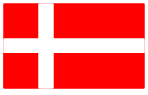
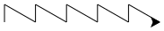
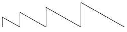

---
sidebar_custom_props:
  id: 61b32e14-80db-449c-9244-548e2e4a7c10
---
import Strukto from '@site/src/components/struktogramm/Strukto';

# Test 26P

Erlaubte Hilfsmittel
: Unterrichtsmaterial
: Eigene Skripts
: Webseiten, Google

Verbotene Hilfsmittel
: ⚠️ Fremde Hilfe
: ⚠️ Chats / Kommunikation jeglicher Art


<Solution webKey="7141cc1f-9721-42ee-a8f9-36dc5f6f6713" title="Testfragen" open>

## Aufgabe 1
*(3 Punkte)*

Das Programm zeichnet eine Sonne mit 11 Strahlen.
1. Ändern Sie das Programm so ab, dass es nun eine Sonne mit 17 Strahlen zeichnet.
2. Setzen Sie die Stiftdicke auf `7` und die Stiftfarbe auf rot.
3. Füllen Sie die Sonne mit Ihrer Lieblingsfarbe (aber nicht mit Rot) aus.

```py live_py title=aufgabe1.py id=f9d50886-1735-46d9-a02c-d6fee5f9f5ad versioned readonly
from turtle import *

speed(0)

def bogen(distanz, drehung):
    for i in range(20):
        forward(distanz)
        left(drehung)

def strahl():
    bogen(3, 5)
    right(90)
    bogen(4, -10)
    left(190)

for i in range(11):
    strahl()
    left(360 / 11)
```

---

## Aufgabe 2
*(3 Punkte)*

Übersetzen Sie das untenstehende Struktogramm in Python Code

:::cards --max-width=400px
<Strukto program={[
    {type: 'step', code: <span><u>90</u>° links</span>},
    {type: 'step', code: <span><u>130</u> Schritte vorwärts</span>},
    {
        type: 'def', 
        code: <span>strecke</span>,
        block: [
            {type: 'step', code: <span><u>40</u> Schritte vorwärts</span>},
            {type: 'step', code: <span><u>25</u>° rechts</span>},
            {type: 'step', code: <span><u>40</u> Schritte vorwärts</span>},
            {type: 'step', code: <span><u>25</u>° links</span>},
        ]
    },
    {
        type: 'def', 
        code: <span>stern</span>,
        block: [
            {
                type: 'repeat', 
                code: <span><u>5</u> mal wiederholen</span>,
                block: [
                    {type: 'call', code: 'strecke zeichnen'},
                    {type: 'step', code: <span><u>216</u>° rechts</span>}
                ]
            }
        ]
    },
    {type: 'call', code: 'stern zeichnen'},
    {type: 'step', code: <span><u>120</u>° links</span>},
    {type: 'call', code: 'stern zeichnen'},
    {type: 'step', code: <span><u>120</u>° links</span>},
    {type: 'call', code: 'stern zeichnen'}
]} />
:::

```py live_py title=aufgabe2.py versioned id=f62c8ac0-bb7f-4603-917d-d3728e5f06de readonly
from turtle import * 
```

---

## Aufgabe 3
**(4 Punkte)**

Finden und korrigieren Sie alle Fehler, so dass die folgende Ausgabe entsteht. Es gibt sowohl Syntaxfehler wie auch Logikfehler.



```py live_py title=aufgabe3.py id=353cb240-4db1-482b-ad29-b59266226a03 versioned readonly
from turtle import *

def rechteck(breite, höhe):
    begin_fill()
    for i in() range(2)
        forward('breite')
        left(90)
        forward(höhe)
        left(90)
    end_fill

color('red')
rechteck(200, 120)
goto(0 50)
color(white)
 rechteck(200, 20)
penup()
goto(50, 0)
pendown()
rechtek(20, 120)

hide_turtle()
```
---

## Aufgabe 4
*(5 Punkte)*

- a) Schreiben Sie ein Programm, welches folgende Zeichnung erzeugt. *(2 Punkte)*



Die Höhe eines Zick-Zacks beträgt `20` Einheiten, die lange Seite ist `40` Einheiten lang und der Innenwinkel beim Zick-Zack beträgt `60°`.


- b) Verwenden Sie Wiederholungen (*1 Punkt*)
- c) Schreiben Sie für das Zeichnen einer einzelnen Zacke einen (selber definierten) Befehl `zickzack` (*1 Punkt*).
- d) Verwenden Sie einen Parameter `size`, so dass die Höhe des Zickzacks verändert werden kann. Erzeugen Sie so folgende Figur mit den Höhen `20`, `30`, `40` und `50`, ohne dabei Punkt (b) zu entfernen. (*1 Punkt*)



```py live_py title=aufgabe4.py versioned id=d19a5323-efdf-4f41-8b17-2bdfbb469813 readonly
from turtle import *
```

---

## ⭐ 5. Zusatzaufgabe
*(Wird für das Erreichen der Note 6 nicht benötigt, 2 Punkte)*

Auf https://de.acervolima.com/zeichnen-sie-herz-mit-turtle-graphics-in-python/ finden Sie Python-Code, welcher ein Herz zeichnet.

- Räumen Sie den Code auf und verwenden Sie nur Befehle, die wir auch im Unterricht besprochen haben. (z.B. haben wir `pen = turtle.Turtle()` nie angeschaut...)
- Schreiben Sie Ihren eigenen Namen in das Herz
- Machen Sie den Rand einen Stift der Breite `10` 

```py live_py title=zusatzaufgabe.py id=f2b7f7be-182e-43c1-bd83-d04dce67d018 versioned readonly

```

</Solution>
