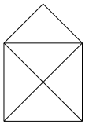

import Answer from '@site/src/components/Answer';

# Einführung Python

Programmieren heisst, einer Maschine Befehle zu erteilen und sie damit zu steuern. Die erste solche Maschine, die Sie steuern, ist eine kleine Schildkröte (bzw. ein kleines Dreieck) auf dem Bildschirm: Die Turtle. Was kann diese Turtle und was musst du wissen, um sie zu steuern?

Turtlebefehle werden grundsätzlich Englisch geschrieben und enden immer mit einem Klammerpaar. Dieses enthält weitere Angaben zum Befehl. Selbst wenn keine weiteren Angaben nötig sind, muss ein leeres Klammerpaar vorhanden sein. Die Klein-/Grossschreibung muss exakt eingehalten werden.

Die Turtle kann sich innerhalb ihres Fensters bewegen und dabei eine Spur zeichnen. Um die Turtle zu bewegen, verwenden wir die drei Befehle `forward(distanz)`, `left(winkel)` und `right(winkel)`.

_Programmierkonzepte_: Quellprogramm editieren, Programm ausführen, Programmsequenz

## Das erste Programm

Das erste Python-Programm zeichnet ein Quadrat. Damit die Befehle zum zeichnen verwendet werden können, muss zuerst eine Datei mit den entsprechenden Befehlen (ein sogenanntes Modul) `turtle` geladen werden.

```py live_py slim title=Quadrat
from turtle import *

left(90)
forward(80)
left(90)
forward(80)
left(90)
forward(80)
left(90)
forward(80)
```

:::note `from turtle import *`

Damit Python die Befehle zum zeichnen verwenden kann, müssen diese zuerst aus einem Modul **importiert** werden. Damit beim Importieren nicht jeder einzelne Befehl angegeben werden muss, wird das Zeichen `*` verwendet welches alle verfügbaren Befehle importiert.
:::

:::note Befehle: `forward`, `left`

Alle Befehle in Python sind nach demselben Schema aufgebaut:

- einen Befehlsnamen
- runde Klammern
- _optional_ in den runden Klammern eine Liste\* von Parametern, die auch leer sein darf.

```
       forward(90)
       \...../  \
         /    Parameter (Bedeutung hier: 90 Schritte vorwärts)
Befehlsname

       penup()
       \.../ \
         /   kein Parameter
Befehlsname
```

\* werden mehrere Parameter übergeben, dann werden diese mit Kommas abgetrennt, z.B. `goto(20, 30)`

:::

:::aufgabe Aufgabe 1
Markieren Sie auf dem Zusatzblatt die Elemente eines Algorithmus mit unterschiedlichen Farben:
- Aufruf eines Unterprogramms (bzw. eines Befehls)
- Parameter
:::

:::aufgabe Aufgabe 2
Ändern Sie die Parameter im Programm "QUADRAT.PY" so ab, dass:

- das Quadrat doppelt so gross gezeichnet wird
- das Quadrat um 45° nach links gedreht gezeichnet wird

```py live_py title=quatrat.py
from turtle import *

left(90)
forward(80)
left(90)
forward(80)
left(90)
forward(80)
left(90)
forward(80)
```

**Zusatz**

Die Form der Turtle kann mit dem Befehl `shape` verändert werden. Ändern Sie auf Zeile `3` die Turtleform auf eine Schildkröte durch **Aufrufen des Befehls** `shape` mit dem **Parameter** `'turtle'`.

<details><summary>Mögliche Parameter für den Befehl <code>shape</code> </summary>

- `'arrow'`
- `'turtle'`
- `'circle'`
- `'square'`
- `'triangle'`
- `'classic'` (standard)

</details>
:::


### Farben

Die Stiftfarbe kann mit dem Befehl `pencolor('red')` auf rot gewechselt werden. Es gibt eine vordefinierte Farbpalette für die Stiftfarben.

```py live_py title=farben slim
from turtle import *

forward(30)
right(90)

pencolor('red')
forward(30)
right(90)

pencolor('blue')
forward(30)
right(90)

pencolor('green')
forward(30)
```

<details><summary>Farbpalette <span className="color-badge red">red</span> <span className="color-badge green">green</span> <span className="color-badge blue">blue</span></summary>

<div className="small-table no-table-header">

|        |                                                                                 |
| :---------- | :------------------------------------------------------------------------------ |
| `yellow`    | <div style={{width: '8em', height: '1em', backgroundColor: 'yellow'}}></div>    |
| `gold`      | <div style={{width: '8em', height: '1em', backgroundColor: 'gold'}}></div>      |
| `orange`    | <div style={{width: '8em', height: '1em', backgroundColor: 'orange'}}></div>    |
| `red`       | <div style={{width: '8em', height: '1em', backgroundColor: 'red'}}></div>       |
| `maroon`    | <div style={{width: '8em', height: '1em', backgroundColor: 'maroon'}}></div>    |
| `violet`    | <div style={{width: '8em', height: '1em', backgroundColor: 'violet'}}></div>    |
| `magenta`   | <div style={{width: '8em', height: '1em', backgroundColor: 'magenta'}}></div>   |
| `purple`    | <div style={{width: '8em', height: '1em', backgroundColor: 'purple'}}></div>    |
| `navy`      | <div style={{width: '8em', height: '1em', backgroundColor: 'navy'}}></div>      |
| `blue`      | <div style={{width: '8em', height: '1em', backgroundColor: 'blue'}}></div>      |
| `skyblue`   | <div style={{width: '8em', height: '1em', backgroundColor: 'skyblue'}}></div>   |
| `cyan`      | <div style={{width: '8em', height: '1em', backgroundColor: 'cyan'}}></div>      |
| `turquoise` | <div style={{width: '8em', height: '1em', backgroundColor: 'turquoise'}}></div> |
| `lawngreen` | <div style={{width: '8em', height: '1em', backgroundColor: 'lawngreen'}}></div> |
| `green`     | <div style={{width: '8em', height: '1em', backgroundColor: 'green'}}></div>     |
| `darkgreen` | <div style={{width: '8em', height: '1em', backgroundColor: 'darkgreen'}}></div> |
| `chocolate` | <div style={{width: '8em', height: '1em', backgroundColor: 'chocolate'}}></div> |
| `brown`     | <div style={{width: '8em', height: '1em', backgroundColor: 'brown'}}></div>     |
| `black`     | <div style={{width: '8em', height: '1em', backgroundColor: 'black'}}></div>     |
| `gray`      | <div style={{width: '8em', height: '1em', backgroundColor: 'gray'}}></div>      |
| `white`     | <div style={{width: '8em', height: '1em', backgroundColor: 'white'}}></div>     |

</div>
</details>

:::warning `'string'`
Beachten Sie die Anführungszeichen rund um die Farb-Namen. Damit Python die Farben als Text (eng. `string`) erkennt und nicht plötzlich nach einem gleichnamigen Befehl sucht, werden rund um Texte immer Anführungszeichen verwendet.
:::

### Stiftbreite

Die Stiftbreite kann mit dem Befehl `pensize(2)` verändert werden. Standardmässig ist die Stiftbreite `1`

```py live_py slim
from turtle import *
forward(20)

pensize(5)
forward(20)

pensize(10)
forward(20)

pensize(15)
forward(20)

pensize(20)
forward(20) 
```


:::warning Zahlen
Beachten Sie, dass bei Zahlen keine Anführungszeichen verwendet werden. *Eine Verwechslungsgefahr mit anderen Befehlen besteht nicht, da in Python keine Befehle mit einer Zahl beginnen.*
:::

:::aufgabe Aufgabe 3: Zickzack

Versuchen Sie, folgendes Zickzack-Muster mit einer Stiftdicke von `5` zu zeichnen. Die Streckenlänge und die Winkel dürfen Sie schätzen.


```py live_py title=zickzack.py
from turtle import *

```

**Zusatz**
Machen Sie bei jedem Richtungswechsel einen Punkt:


:::

## Kommentare

In Python können Kommentare eingefügt werden, die aber auf die Ausführung des Programms **keinen Einfluss** haben.
Kommentare sind eine wichtige Hilfe, um Programme (Algorithmen) besser zu verstehen, oder aber um zusätzliche Informationen, wie den Autor des Programms, festzuhalten.

```py live_py slim
# Autor: B. Hofer
# Datum: 5.09.2021

from turtle import *      # importiere alle Befehle der Bibliothek "turtle"

speed(1)        # verlangsame die Turtle auf die langsamste Geschwindigkeit
forward(100)    # 100 Schritte vorwärts
left(120)       # drehe um 120 ° nach links
speed(3)        # zurück auf Normalgeschwindigkeit
forward(100)
left(120)
speed(10)       # Schneller...
forward(100)
left(120)
hideturtle()    # verstecke die Turtle
```


:::aufgabe Aufgabe 4
Versuchen Sie nachzuvollziehen, welche Zeile was macht.

Fügen Sie immer wenn ein Unterprogramm zum ersten Mal verwendet wird, einen **Kommentar** hinzu, was dieses Unterprogramm macht und, falls vorhanden, welchen Einfluss die Parameter haben.

```py live_py title=Stift-und-Punkte
from turtle import *

forward(40)
left(90)

penup()
forward(40)
dot(10)
right(180)
forward(40)
left(90)
pendown()

forward(40)
left(90)
forward(80)
left(90)
forward(80)
left(90)
forward(80) 
```
:::

:::aufgabe Aufgabe 5: Würfel

Ändern Sie dann das Programm so, dass die gewürfelte Zahl `5` gezeichnet wird:


Verstecken Sie auch die Turtle am Ende.

```py live_py title=Würfel__5.py
from turtle import *

forward(40)
left(90)

penup()
forward(40)
dot(5)
right(180)
forward(40)
left(90)
pendown()

forward(40)
left(90)
forward(80)
left(90)
forward(80)
left(90)
forward(80) 
```
:::

## Aufgaben

:::aufgabe Aufgabe 6: Haus von Nikolaus
Das "Haus vom Nikolaus" ist ein Zeichenspiel für Kinder. Ziel ist es, das besagte Haus in einem Linienzug aus genau acht Strecken zu zeichnen, ohne dabei eine Strecke zweimal zu durchlaufen. Zeichnen Sie das Haus vom Nikolaus.



```py live_py title=haus__nikolaus.py
from turtle import *
```

**Zusatz**:

Verwenden Sie für die Zeichnung Ihre Lieblingsfarbe und eine grössere Stiftdicke.

:::


:::aufgabe Aufgabe 8: Treppe

Zeichnen Sie eine Treppe mit einer Breite von `29` Pixeln und einer Höhe von `17` Pixeln.


```py live_py title=treppe.py
from turtle import *
```
:::