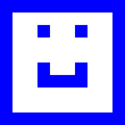

---
sidebar_custom_props:
  id: 4a47c474-17cd-4822-8300-e2ed20dff974
---
# Grid

Canvas Grid in Brython

## Smiley



```py live_py slim title=smiley.py
from grid import Grid

Grid.setup(500, 500) # canvas screen size
grid = Grid(10, 10)
grid[2][3] = 'blue'
grid[2][6] = 'blue'

for i in range(2):
    grid[5][3 + 3 * i] = 'blue'
for i in range(3, 7):
    grid[6][i] = 'blue'
    
for i in range(10):
    for j in range(10):
        grid[i][0] = 'blue'
        grid[i][9] = 'blue'
        grid[0][i] = 'blue'
        grid[9][i] = 'blue'
```

## Schachbrett

```py live_py slim title=smiley.py
from grid import Grid

grid = Grid(8, 8)

for i in range(8):
    for j in range(8):
        if (i + j) % 2 == 0:
            grid[i][j] = 'black'
        else:
            grid[i][j] = 'white'
```

## Animiert


```py live_py slim title=anim.py
from grid import Grid
from game import gameloop, sleep, stop

Grid.setup(500, 500)
grid = Grid(10, 10)

x = 0
y = 0
direction = [1, 0]
@gameloop
def run(dt):
    global x, y, direction
    grid[x][y] = ''
    if direction[0] > 0 and x == grid.size[0] - 1:
        direction = [0, 1]
    elif direction[0] < 0 and x == 0:
        direction = [0, -1]
    elif direction[1] > 0 and y == grid.size[1] - 1:
        direction = [-1, 0]
    elif direction[1] < 0 and y == 0:
        direction = [1, 0]
    x = x + direction[0]
    y = y + direction[1]
    grid[x][y] = 'black'
    sleep(200)

run()
```