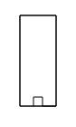
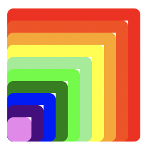
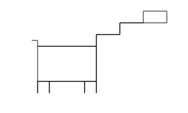

---
sidebar_custom_props:
  id: 2ceef5f9-0b55-4c1e-89a5-3100ca9f5d22
---
# Turtle Graphics

[Skripts Herunterladen](skeletons/01_turtles.zip)

## Befehle

```py
# Muss zuoberst im Skript stehen, um alle Befehle zum
# Zeichnen verfügbar zu machen
from gbsl_turtle import *

forward(100)    # 100 Schritte vorwärts
backward(100)   # 100 Schritte rückwärts
left(90)        # 90° links drehen
right(90)       # 90° rechts drehen

setheading(0)       # Orientierung festlegen: nach rechts schauen ▶️
setheading(90)      # Orientierung festlegen: nach oben schauen   🔼
setheading(180)     # Orientierung festlegen: nach links schauen  ◀️
setheading(-90)     # Orientierung festlegen: nach unten schauen  🔽

goto(50, 10)    # Springt zum Punkt (50, 10). Die Linie wird gezeichnet
                #   Von der Mitte des Bildschirms 50 Pixel rechts 
                #   und 10 Pixel nach Oben

goto(50, 10, draw=False) # Wie goto(50, 10), aber der Stift wird abgehoben

done()  # fertig mit Zeichnen - warte auf Klick aufs Ausgabefenster
```

### Weitere Befehle

```py
pensize(10)     # setzt die Stiftbreite auf 10
pencolor('red') # setzt die Stiftfarbe auf rot

penup()         # hebt den Stift ab - alle folgenden Befehle hinterlassen
                #   keine Linie
pendown()       # setzt den Stift ab - alle folgenden Befehle zeichnen wieder
clear()         # löscht alles gezeichnete

home()              # Springt zum Punkt (0, 0) und setzt die Orientierung
                    # zurück (schaut nach rechts)
home(draw=False)    # wie home(), nur dass keine Linie gezeichnet wird

write('Hallo')  # Schreibt 'Hallo'

hideturtle()    # Versteckt das Dreieck
showturtle()    # Zeigt das Dreieck wieder

speed(0)        # zeichnet so schnell wie möglich
speed(10)       # zeichnet so langsam wie möglich

# Advanced
Screen().tracer(2)  # führt nur jede zweite Bildschirm-Aktualisierung durch.
                    #   Sinnvoll bspw. fürs Zeichnen eines Kreises
Screen().tracer(1)  # Standard-Einstellung
```

## Aufgaben

[Skripts Herunterladen](skeletons/01_turtles.zip)

1. Schreiben Sie ein Programm, das ein Hochhaus zeichnet

   

   Zusatz: zeichnen Sie die Eingangstüre blau.

2. Schreiben Sie ein Programm, das eine Spirale zeichnet

   

3. Schreiben Sie ein Programm, das die folgenden Quadrate zeichnet

   

   **Tipp** Beginnen Sie mit einem Quadrat mit Seitenlänge _100_ und werden dann immer _10_ Einheiten kürzer.

   **Zusatz** Zeichnen Sie ein Regenbogen-Quadrat und setzen Sie die Stiftbreite auf _10_ Einheiten.

   ```py
   # Regenbogenfarben:
   rainbow_colors = [
      'red',
      'orangered',
      'orange',
      'yellow',
      'lightgreen',
      'lime',
      'green',
      'blue',
      'indigo',
      'violet'
   ]
  ```

   

4. Schreiben Sie ein Programm, das eine Tier-ähnliche Form zeichnet

   
