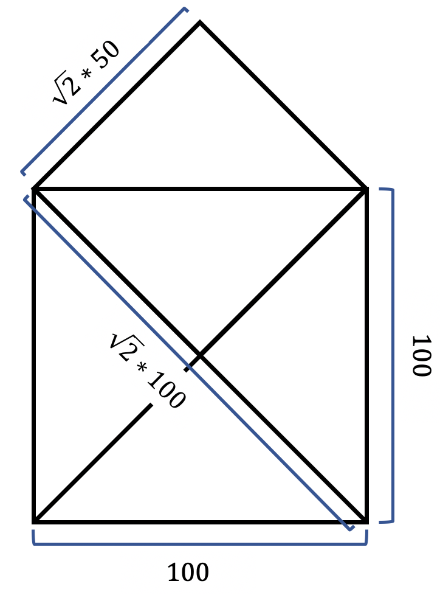

# Funktionen

[06_functions.zip](skeletons/06_functions.zip)

## Voraussetzung

Sie haben auf [jupyter.gbsl.website](https://jupyter.gbsl.website) das `Kapitel 5` bis und mit `Kapitel 5.1` gelesen und bearbeitet.

1. Zeichnen Sie ein Nikolaus-Haus. Um die Länge der Diagonalen zu bestimmen, müssen Sie die Wurzel aus `2` berechnen. Dies können Sie, indem Sie die Funktion `sqrt` (abkürzung für Squareroot, übersetzt auf deutsch Quadratwurzel) aus der Bibliothek `math` importieren:

   ```py
   from math import sqrt
   forward(100 * sqrt(2))
   ```

   

2. Verschieben Sie den Code, welche das Haus zeichnet, in eine Funktion `haus()` und rufen Sie die Funktion auf, damit ein Haus gezeichnet wird.

3. Erzeugen Sie nun ein ganzes Quartier mit min. `10` Häusern (Tipp. verwenden Sie eine Schleife). Die Häuser sollen zufällig positioniert werden.

   Die Funktion `randint(-10, 10)` gibt eine zufällige Zahl zwischen `-10` und `10` zurück.

   ```py
   pos_x = randint(-10, 10)
   pos_y = randint(-10, 10)
   goto(pos_x, pos_y, draw=False)
   ```

   Die Positionen sollen zwischen `-150` und `150` gesetzt werden.

   

4. Ändern Sie die Funktion so, dass Sie die Grösse des Hauses beim Funktionsaufruf mitgeben können. `haus(10)` soll ein haus mit Seitenbreite `10` zeichnen, `haus(100)` eines mit Seitenbreite `100`.

   

5. Zeichnen Sie eine farbeige Stadt:

   

   Dazu brauchen wird die Funktion `cycle()`, welche eine Liste auf einem Drehteller ablegt; nachdem die letzte Farbe verwendet wurde, wird wieder die erste Farbe zurückgegeben:

   

   ```py
   from itertools import cycle
   colors = [
      'red',
      'green',
      'blue'
   ]
   color_cycle = cycle(colors)
   color = next(color_cycle) # => red
   color = next(color_cycle) # => green
   color = next(color_cycle) # => blue
   color = next(color_cycle) # => red
   ```

   Statt nur drei Farben, können Sie auch bspw. die Regenbogenfarben verwenden:

   ```py
   # Regenbogenfarben:
   rainbow_colors = [
      'red',
      'orangered',
      'orange',
      'yellow',
      'lightgreen',
      'lime',
      'green',
      'blue',
      'indigo',
      'violet'
   ]
   ```

---

## Zeichnungen mit Funktionen erzeugen

<a class="theorie" href="https://jupyter.gbsl.website" target="_blank">5 Funktionen</a>

- 6 Auf [https://io.gbsl.website/controller](https://io.gbsl.website/controller) gibt es `4` Funktionstasten. Wird eine solche geklickt, wird im Skript mit derselben `DeviceID` die Funktion `on_f1`, bzw. `on_f2`, `on_f3` oder `on_f4` aufgerufen.

  - `F1` zeichnet ein Haus
  - `F2` ein `8`eck
  - `F3` einen `5`er Stern
  - `F4` ändert die Position mit `goto()` zu einem zufälligen neuen Punkt.

- 7 Auf [https://io.gbsl.website/controller](https://io.gbsl.website/controller) können auch die Steuertasten verwendet werden. Sobald eine solche Taste geklickt wird, wird die Funktion `on_key(data)` aufgerufen. In `data.key` steht eine der folgenden Texte drin:
  - `up`
  - `right`
  - `down`
  - `left`
  - `home`

   Mit den Schlüsselwörtern `if`, `elif` und `else` ist es möglich, Codeteile nur dann auszuführen, wenn ein Vergleich zutrifft oder nicht.

   ```py
   key = "up"

   if key == "down":
      print("Runter")
   elif key == "up":
      print("Rauf!!")
   elif key == "right":
      print("Rechts!!")
   elif key == "left":
      print("Links!")
   else:
      print("Unbekannte Richtung!!!")

   print("Fertig")
   ```


   Hier wird überprüft, ob `key` dem Text `down` entspricht (nein). Falls nicht, wird mit `elif` eine weitere Bedingung überprüft: ob `key` dem Text `up` entspricht (ja). aller eingerückte Code nach Zeile `5` ausgeführt - es wird also `Rauf!!` ausgegeben. Danach springt die Code-Ausführung direkt zu Zeile `14`.

   Was würde ausgegeben wenn auf Zeile `1`: `key = "home"` stehen würde? Alle Bedingungen würden nicht zutreffen, weshalb der "Sonst"-Fall (`else`) eintrifft und die Zeile `12` ausgeführt wird.

   Schreiben Sie ein Programm, welches bei

   - `up` `10` Schritt nach vorn
   - `right` `45°` nach rechts
   - `down` `10` Schritt rückwärts
   - `left` `45°` nach links
   - `home` nach hause (`home()`)

   geht.

   <a class="theorie" href="https://jupyter.gbsl.website" target="_blank">6: Bedingte Ausführung</a>
