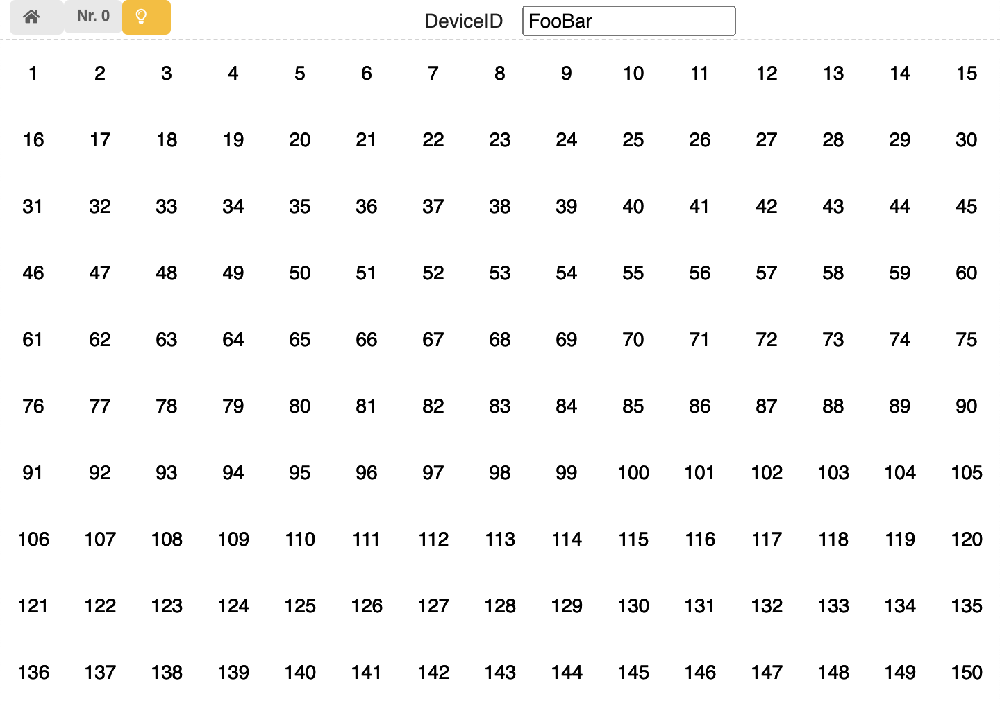

---
sidebar_custom_props:
  id: 1a433856-95a0-4cba-ac12-03aa35e679ca
---
# Sieb des Eratosthenes

[09_grid.zip](skeletons/09_grid.zip)

Mit folgendem Programm wird auf [https://io.gbsl.website/color_grid](https://io.gbsl.website/color_grid) ein Gitternetz mit nummerierten Feldern erzeugt.

```py
from smartphone_connector import Connector

device = Connector('https://io.gbsl.website', 'FooBar')
device.setup_grid(10, 15, enumerate=True)

# verbindung mit dem Gerät beenden
device.disconnect()
```



Mit dem Befehl `device.set_grid_at(cell_number=1, color="red")` kann die Farbe des ersten Feldes auf rot gesetzt werden. Als Farbe sind alle englischen Farb-Namen erlaubt.

Weiter kann mit dem Befehl `device.get_grid_at(cell_number=1)` die aktuelle Farbe des ersten Feldes abgefragt werden.

## Aufgaben

1. Zeichnen Sie ein `10x10` grosses Gitternetz und färben Sie folgenden Felder rot ein:

   - alle Felder der 2er Reihe, ausser die 2 selbst
   - alle Felder der 3er Reihe, ausser die 3 selbst
   - alle Felder der 5er Reihe, ausser die 5 selbst
   - alle Felder der 7er Reihe, ausser die 7 selbst

   Was fällt Ihnen auf? Was für Zahlen sind auf den noch weissen feldern abgebildet?

2. Dieser Algorithmus zum Auffinden von Primzahlen wurde schon viele Jahrhunderte vor Christus entdeckt, es war aber Eratosthenes welcher ca. 300 v. Chr. dieses Verfahren "Zahlensieb" nannte, weshalb es bis heute noch "Sieb des Eratosthenes" genannt wird.

   Der eigentliche Algorithmus funktioniert wie folgt:

   1. Starte bei der Zahl 2
   2. Ist das Ende des Gitters erreicht, springe zu Punkt 4.

      - Ist das Feld rot, fahre mit Schritt 3 weiter.
      - Ist das aktuelle Feld noch nicht rot, so ist es eine Primzahl und wird _nicht_ rot gefärbt. Alle Vielfachen dieser Zahl bis zum Ende des Gitters werden rot gefärbt.

   3. Gehe zum nächsten Feld und fahre mit Schritt 2 weiter.
   4. Ende

   Implementieren Sie diesen Algorithmus und prüfen Sie ihn mit einem `20x20` Gitter.

   **Zusatz**: Eigentlich müssen nicht ganz alle Felder überprüft werden. Optimieren Sie ihr Programm, indem Sie nur soviele Felder überprüfen, wie minimal nötig sind.
