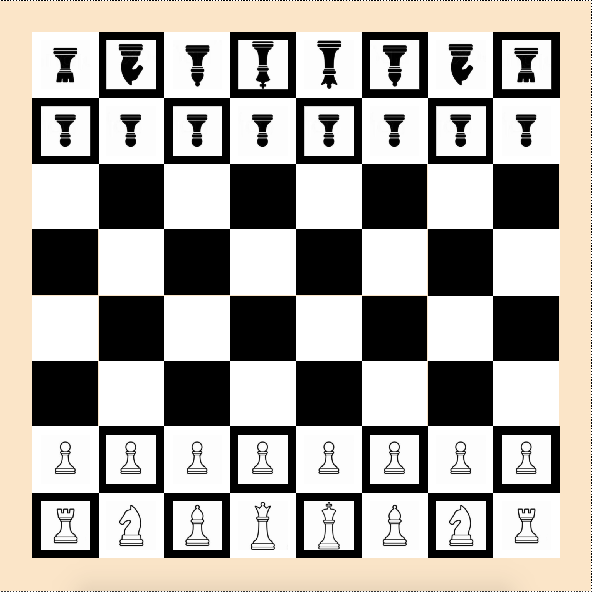

import Tabs from '@theme/Tabs';
import TabItem from '@theme/TabItem';

# Modulo

[11_modulo.zip](skeletons/11_modulo.zip)

## 1. Kalender

Schreiben Sie ein Programm, das von einem gegebenen Datum im 21. Jahrhundert (vom 1. 1. 2001 bis 31.12.2100) den Wochentag bestimmt.

Dabei muss Folgendes beachtet werden:

- Der 1.1.2001 war ein Montag.
- Schaltjahre haben `366` statt `365` Tage. Ein Schaltjahr ist...
  - durch `4` teilbar, aber nicht durch `100` teilbar
  - **Ausnahme**: Ist die Jahreszahl durch `400` teilbar, dann ist es ein Schaltjahr

**Zusatzaufgabe**: Erweitern Sie das Programm so, dass es für alle Daten im Gregorianischen Kalender (ab Freitag 15.10.1582) funktioniert.


<Tabs
  defaultValue="step-1"
  values={[
    {label: 'Schritt 1', value: 'step-1'},
    {label: 'Schritt 2', value: 'step-2'},
    {label: 'Schritt 3', value: 'step-3'},
    {label: 'Schritt 4', value: 'step-4'},
    {label: 'Schritt 5', value: 'step-5'},
  ]}>
  <TabItem value="step-1">

Zuerst über eine Eingabe Tag, Monat und Jahr abfragen (achtung Datentyp...).

```py
tag = input('Tag')
monat = input('Monat')
jahr = input('Jahr')
```

  </TabItem>
  <TabItem value="step-2">

Erster Schritt: Wie bestimmt man den Wochentag?

**Szenario**: Nur Daten für den Januar 2001 funktionieren.

--> Wir brauchen eine Liste, welche der Reihe nach die Wochentage enthält.

**Aufgabe**: Der 1.1.2001 sollte ein Montag sein. Das stimmt aktuell noch nicht. Wie muss das Programm angepasst werden, damits stimmt? Wieso?

```py
TAGE = ['Mo', 'Di', 'Mi', 'Do', 'Fr', 'Sa', 'So']

wochentag = TAGE[tag % 7]
print(wochentag)
```

  </TabItem>
  <TabItem value="step-3">


**Szenario**: Nur Daten für das Jahr 2001 funktionieren.

Es müsssen die Anzahl Tage jedes **verstrichenen** Monats umgewandelt werden. Dazu erstellen wir eine Liste, welche die Anzahl Tage jedes Jahres enthält.

**Aufgabe**:

1. Der Tag kann nun berechnet werden durch den entstehenden Rest von `tag + monats_tage`.
2. Überprüfe: Der 1.6.2001 ist war ein Freitag. _Hinweis_: Aktuell wird es noch "Sonntag" ausgeben, wieso? Überprüfe wie viele Monate zu `monats_tage` hinzugefügt werden

```py
MONATE = [31, 28, 31, 30, 31, 30, 31, 31, 30, 31, 30, 31]

monates_tage = 0
for m in range(0, monat, 1):
    monates_tage = monates_tage + MONATE[m]
```

  </TabItem>
  <TabItem value="step-4">


**Szenario**: Nur Daten für bis zum Jahr 2003 funktionieren.

**Aufgabe**:

Der Tag kann nun berechnet werden durch den entstehenden Rest von `tag + monats_tage + jahres_tage`. Der 1.6.2003 sollte ein Sonntag sein.

```py
jahres_tage = 0
for year in range(2001, jahr, 1):
    jahres_tage = jahres_tage + 365
```

  </TabItem>
  <TabItem value="step-5">

**Szenario**: Schaltjahre, bis 2001

- Beim Berechnen von `jahres_tage` überprüfen, ob ein Jahr ein Schaltjahr ist. Falls ja: `366` Tage hinzufügen, sonst `365`
- Beim Berechnen von `monats_tage` überprüfen, ob das gewählte Jahr ein Schaltjahr ist **und** ob der Monat nach dem Februar gewählt ist. Dann muss noch ein Tag zusätzlich hinzugefügt werden.

**Überprüfen**

- 28.6.2020 war ein Sonntag
- 28.6.2100 wird ein Montag sein


  </TabItem>
</Tabs>

```py live_py title="kalender.py"
# kalender

```

## 2. Schachbrett

Erzeugen Sie auf [https://io.gbsl.website](https://io.gbsl.website/playground) ein `8x8` Schachbrett.


**Tipps**:

- Zeichnen Sie ein Feld `20x20` einheiten gross
- verwenden Sie eine verschachtelte `for`-Schleife - eine für die `y`-Werte, eine für die `x`-Werte:
  

### Zusatz

Stellen Sie die Schach-Figuren auf:



Die Bilder für die Figuren finden Sie im Ordner `chess` - dieser Ordner muss beim Konfigurieren des Playgrounds angegeben werden:

```py
device.configure_playground(
  width=180,
  height=180,
  origin_x=10,
  origin_y=10,
  color='bisque',
  images='chess'
)
```

Anschliessend kann einem Objekt ein Hintergrundbild mitgegeben werden (**Achtung**: nur der Name des Bildes wird angegeben, keine Dateierweiterung!).

```py
device.add_square(
  pos_x=0,
  pos_y=0,
  size=15,
  image='s_dame'
)
```

[Theorie: Jupyterhub Kapitel 7.4](https://jupyter.gbsl.website/user-redirect/lab/tree/shared/07T_Playground.ipynb)

**Tipp**: Setzen Sie den Anker der Schach-Figuren auf `anchor=[0.5, 0.5]`.