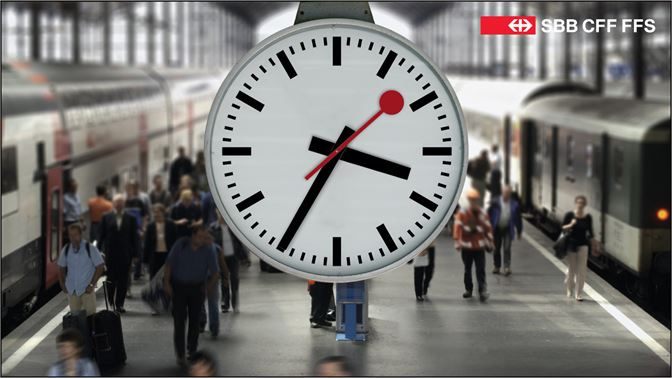
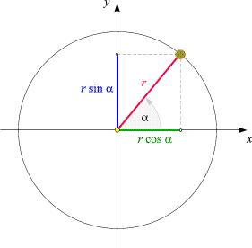

---
sidebar_custom_props:
  id: eed6d5e8-5522-4c7d-92ab-5d913654dc12
---
# Uhren

[10_uhren.zip](skeletons/10_uhren.zip)

**Voraussetzung**: [Theorie: Jupyterhub 7-7.2](https://jupyter.gbsl.website/user-redirect/lab/tree/shared/07T_Playground.ipynb)


## SBB Uhr



1. Schreiben Sie ein Programm, welches die abgebildete SBB-Uhr zeichnet inkl. ihrer Uhrzeit zeichnet.

   Für das Lösen dieser Aufgabe können die Sinus- und Kosinus Funktionen verwendet werden:
   

   In Python können diese Funktionen aus der `math` Bibliothek importiert werden.

   !!**Achtung**: `cos` und `sin` erwarten die Winkel-Angaben im Bogenmass (im Bogenmass entspricht $\pi$ `180°`). Allfällige Grad-Angaben müssen daher zuerst umgerechnet werden. Im foglenden Beispiel werden z.B. der Sinus von 15° bzw. der Kosinus von 33° berechnet und in einer Variable gespeichert:

   ```py
   from math import cos, sin, pi

   sin15 = sin(15 / 180 * pi)
   cos33 = cos(33 / 180 * pi)
   ```

2. Fragen Sie den Benutzer nach einer Uhrzeit (zuerst die Stunden, dann die Minuten und schliesslich die Sekunden) und stellen Sie dann diese Uhrzeit ein.
3. Animieren Sie Ihre Uhr. Die SBB Uhr hat die Eigenheit, dass der Sekunden-Zeiger nur `59` Sekunden für eine Umdrehung hat, weil er auf 12 Uhr für 1 Sekunde stehen bleibt.

   **Tipps**:

   - Mit `device.sleep(1.0)` wird die Ausführung des Programms für eine Sekunde unterbrochen.
   - Mit der Funktion `time_ns()` (aus der Bibliothek `time`) können Sie die aktuelle Systemzeit in Nanosekunden abfragen. Rechnen Sie zuerst von Nanosekunden zu Sekunden um.
     ```py
     from time import time_ns
     print(f"Aktuelle Systemzeit: {time_ns()}")
     ```
