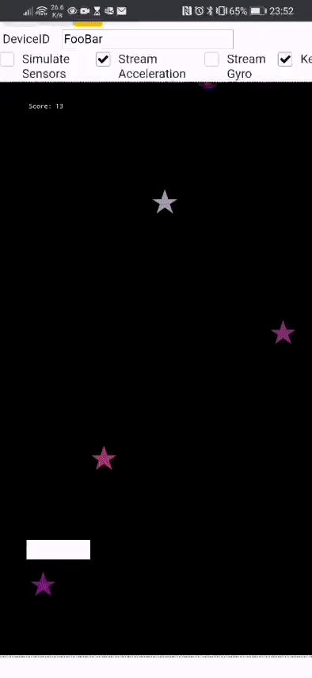
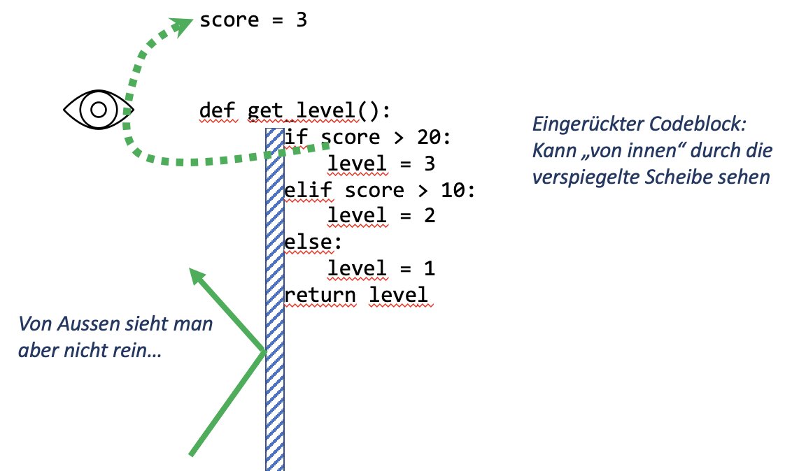
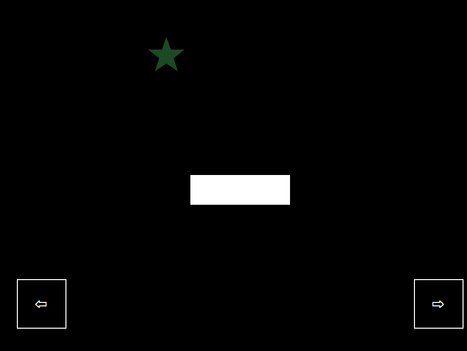

import Tabs from '@theme/Tabs';
import TabItem from '@theme/TabItem';

# Game Basics - Sterne Fangen



Die Funktionalität der mit einem \* markierten Abschnitte sollten in Eurem Spiel enthalten sein.

## 0. Vorbereitung \*

Auf OneDrive einen neuen Ordner `12_game` erstellen und diesen in VS Code öffnen. Dort ein neues Programm erstellen, bspw. mit dem Namen `01_game.py`

## 1. Spieler \*

<Tabs
    defaultValue="step-1"
    values={[{label: 'Schritt 0', value: 'step-0'},
    {label: 'Schritt 1', value: 'step-1'},
    {label: 'Schritt 2', value: 'step-2'},
    {label: 'Schritt 3', value: 'step-3'}]}
>
<TabItem value="step-0">

Das erste Spiel startet mit der bekannten Ausgangslage.

- **wichtig**: DeviceId so anpassen, dass sie mit derjenigen auf der Website [https://io.gbsl.website](https://io.gbsl.website) übereinstimmt.

**Code laufen lassen und schauen ob alles funktioniert**

```py
from smartphone_connector import *
device = Connector('https://io.gbsl.website', 'FooBar')
device.configure_playground(
    width=100,
    height=180,
    origin_x=50,
    origin_y=0,
    color=Colors.BLACK
)

# der weitere Code wird hier eingefügt...

device.disconnect()
```

</TabItem>

<TabItem value="step-1">

Damit bei Änderungen der aktuelle Playground zuerst aufgeräumt wird, sollte dieser vor dem Konfigurieren gelöscht werden:

```py

device = Connector('https://io.gbsl.website', 'FooBar')

device.clear_playground()

device.configure_playground(
    width=100,
    height=180,
    origin_x=50,
    origin_y=0,
    color=Colors.BLACK
)
```

</TabItem>

<TabItem value="step-2">

Nun wird ein Spieler hinzugefügt - ein Balken welcher später durch Kippen des Smartphones bewegt werden soll.

```py
device.add_rectangle(
    width=20,
    height=10,
    color=Colors.WHITE,
    pos_x=0,
    pos_y=20
)
```

</TabItem>

<TabItem value="step-3">

Die Position stimmt noch nicht - der Balken soll zentral unten in der Mitte positioniert sein. Über den **Parameter** `anchor` kann bestimmt werden, welcher Punkt im Rechteck positioniert wird.

- `[0, 0]` bedeutet unten links,
- `[1, 1]` oben rechts...
- Was bewirkt der untenstehende Wert für `anchor`?

Vorerst reicht diese Vorbereitung aus, im Abschnitt "Steuerung" wird die Kontrolle des Rechtecks vorgenommen. Zuerst aber wirds etwas bunt - wir lassen Sterne vom Himmel fallen 🌟

```py
device.add_rectangle(
    width=20,
    height=10,
    color=Colors.WHITE,
    pos_x=0,
    pos_y=20,
    anchor=[0.5, 0]
)
```

</TabItem>
</Tabs>

---

## 2. Sterne \*

<Tabs
    defaultValue="step-1"
    values={[{label: 'Schritt 0', value: 'step-0'},
    {label: 'Schritt 1', value: 'step-1'},
    {label: 'Schritt 2', value: 'step-2'},
    {label: 'Schritt 3', value: 'step-3'},
    {label: 'Schritt 4', value: 'step-4'}]}
>
<TabItem value="step-0">

Der Stern wird als Text-Zeichen `★` mitgegeben. Damit nur der Stern angezeigt wird, werden keine `color` oder `border_color` Parameter übergeben.

Der Stern soll vom oberen Rand des Bildschirms nach unten fallen. Wie?

```py
device.add_circle(
    text='★',
    font_color=Colors.GOLD,
    font_size=10,
    pos_x=0,
    pos_y=180,
    radius=3
)
```

</TabItem>

<TabItem value="step-1">

... der Stern bekommt eine Richtung, in welche er sich mit der Geschwindigkeit `4` bewegen soll.

Nächster Schritt: regelmässig neue Sterne erzeugen

```py
device.add_circle(
    text='★',
    font_color=Colors.GOLD,
    font_size=10,
    pos_x=0,
    pos_y=180,
    radius=3,
    direction=[0, -1],
    speed=4
)
```

</TabItem>

<TabItem value="step-2">

Um regelmässig neue Sterne zu erzeugen, kann die Bibliothek `smartphone_connector` angewiesen werden, regelmässig eine von uns definierte Funktion auszuführen. Dies geschieht über die Methode `device.subscriby_async`. Das `async` steht für "Asynchron" und bedeutet, dass parallel zum regelmässigen Aufrufen unserer Funktion weitergearbeitet werden kann.

Unten wird eine neue Funktion erstellt. Diese soll nun alle `2` Sekunden ausgeführt werden.

**Aufgabe**: Verwende bei deinem Skript einen passenden, deutschen Funktionsnamen.

(_Hinweis_: Das Programm erzeugt zwar keinen Fehler, aber es werden noch keine Sterne hinzugefügt 😢. Wieso? ▶️)

```py
def add_star():
    device.add_circle(
        text='★',
        font_color=Colors.GOLD,
        font_size=10,
        pos_x=0,
        pos_y=180,
        radius=3,
        direction=[0, -1],
        speed=4
    )


device.subscribe_async(add_star, 2)
```

</TabItem>

<TabItem value="step-3">

Wir erleben die direkten Konsequenzen davon, dass `device.subscriby_async` asynchron läuft! Obwohl die Aufgabe (nämlich alle `2` Sekunden einen Stern hinzuzufügen) abgeschlossen ist, wird mit der nächsten Zeile weitergefahren.

Und auf der letzten Zeile steht `device.disconnect()` - also die Verbindung wird abgebrochen. Besser sollte dort gewartet werden, bis das Programm vom Benutzer gestoppt wird (mit dem 🗑️-Symbol).

```py
def add_star():
    device.add_circle(
        text='★',
        font_color=Colors.GOLD,
        font_size=10,
        pos_x=0,
        pos_y=180,
        radius=3,
        direction=[0, -1],
        speed=4
    )


device.subscribe_async(add_star, 2)

device.wait()
```

</TabItem>

<TabItem value="step-4">

Yeah 🎊 🌟 🤩

Weiteres Vorgehen:

- Die Start-Position der Sterne **zufällig** über die ganze Playground-Breite verteilen.
- Zufällige Farben für die Schriftfarbe verwenden
- (evtl. zufällige Grössen der Sterne?)

```py
from random import randint
```

</TabItem>
</Tabs>

---

## 3. Controller \*

<Tabs
    defaultValue="step-1"
    values={[{label: 'Schritt 0', value: 'step-0'},
    {label: 'Schritt 1', value: 'step-1'},
    {label: 'Schritt 2', value: 'step-2'},
    {label: 'Schritt 3', value: 'step-3'},
    {label: 'Schritt 4', value: 'step-4'}]}
>
<TabItem value="step-0">

**Achtung!!**: Für die Kontrolle werden die Beschleunigungssensoren des Smartphones ausgelesen. Deshalb sollte für diesen Schritt jeweils auf dem Smartphone [https://io.gbsl.website](https://io.gbsl.website/playground) aufgerufen werden und die Option _"Stream Acceleration"_ angeschaltet werden.

Nun soll das Rechteck kontrollierbar werden. Dazu schreiben wir eine ähnliche Logik wie beim interaktiven Zeichnen mit den Turtles. Auch hier starten wir wieder eine asynchrone Subscription.

Vorerst wird nur das Grundgerüst erstellt, die Funktion tut aktuell aber noch nichts.

**Wichtig** Der eingefügte Code muss oberhalb von `device.wait()` eingefügt werden.

**Aufgabe**:

- Überprüfe ob beim Starten des Programms im Terminal in hoher Frequenz "Controller Update" ausgegeben wird.
- Verwende einen deutschen Funktionsnamen für die Update Funktion.

```py
def on_update():
    print('Controller Update')


device.subscribe_async(on_update, 0.05)

device.wait()
```

</TabItem>

<TabItem value="step-1">

Um zu wissen, in welche Richtung das Rechteck verschoben werden soll, müssen wir irgendwie an die aktuellen Sensor-Daten unseres Smartphones rankommen.

Der beim `subscribe_async` angegebenen Funktion (hier `on_update`) werden optional die aktuellen Daten des Smartphones übergeben. Damit das Autovervollständigung im Editor richtig funktioniert, wird beim Parameter `data` nach einem Doppelpunkt der Typ angegeben.

Nun können auf die Beschleunigungswerte zugegriffen werden.

**Aufgabe**:

- Überprüfe, ob sich die Werte im Terminal ändern, wenn das Smartphone bewegt wird.

```py
def on_update(data: DataFrame):
    print('acceleration x', data.acceleration.x)


device.subscribe_async(on_update, 0.05)

device.wait()
```

</TabItem>

<TabItem value="step-2">

Um die Position des Rechtecks zu aktualisieren, muss bekannt sein, welches der vielen Objekte auf dem Bildschirm aktualisiert werden soll. Jedes dieser Objekte hat eine eindeutige (zufällig generierte) `id`. Wir können diese Identifikation aber auch selber beim Erstellen des Rechtecks vergeben, so dass wir dieses Objekt kennen.

Funktioniert die Steuerung schon wunschgemäss? Können beide Ränder erreicht werden?

**Achtung!**: der weisse Balken für den Spieler wurde bereits hinzugefügt (im Programm suchen wo...) - nun muss lediglich die `id` hinzugefügt werden.

```py

device.add_rectangle(
    id='player',
    width=20,
    height=10,
    color=Colors.WHITE,
    pos_x=0,
    pos_y=20
)


def on_update(data: DataFrame):
    pos_x = data.acceleration.x
    device.update_rectangle(
        id='player',
        pos_x=pos_x
    )
```

</TabItem>

<TabItem value="step-3">

Um die Steuerung brauchbar zu machen, muss die aktuelle Position des Rechtecks zwischengespeichert werden - und zwar ausserhalb der Funktion `on_update`, damit sie nicht ständig auf den Ausgangswert zurückgesetzt wird.

Nun gibt es aber eine Art verspiegelte Scheibe zwischen eingerückten- und nicht eingerückten Code-Teilen:



Diese verspiegelte Scheibe verhindert zudem, dass von Innerhalb eine Variable von Ausserhalb geändert wird.

Dieses Prinzip wird "Kapselung" genannt und ist enorm wichtig, um das Zusammespiel von Bibliotheken zu ermöglichen. Stellen Sie sich das Chaos vor, wenn Sie ein neues Programm schreiben, und dann immer ausprobieren müssen, ob Sie beim Erstellen einer Variable nicht plötzlich eine wichtige Variable einer Bibliothek überschreiben...

In gewissen Situationen möchten wir aber Variablen der Aussenwelt ändern. Um dies zu tun, muss die Variable innerhalb des eingerückten Codeblocks als `global` gekennzeichnet werden.

**Achtung!**: Es reicht aus, wenn nur eine Funktion im Programm `on_update` heisst. Ändern Sie also diese Funktion ab, statt eine neue hinzuzufügen.

```py
player_pos_x = 0


def on_update(data: DataFrame):
    global player_pos_x
    player_pos_x = player_pos_x + data.acceleration.x
    device.update_rectangle(
        id='player',
        pos_x=player_pos_x
    )
```

</TabItem>

<TabItem value="step-4">

Und zu guter letzt: Das Rechteck soll nicht abhauen können...

**Aufgabe**: Überprüfe auch, dass das Rechteck links nicht komplett über den Rand hinausschiesst.

```py
player_pos_x = 0


def on_update(data: DataFrame):
    global player_pos_x
    player_pos_x = player_pos_x + data.acceleration.x
    if player_pos_x > 50:
        player_pos_x = 50
    device.update_rectangle(
        id='player',
        pos_x=player_pos_x
    )
```

</TabItem>
</Tabs>

---

## 4. Highscore \*

<Tabs
    defaultValue="step-1"
    values={[{label: 'Schritt 0', value: 'step-0'},
    {label: 'Schritt 1', value: 'step-1'},
    {label: 'Schritt 2', value: 'step-2'},
    {label: 'Schritt 3', value: 'step-3'},
    {label: 'Schritt 4', value: 'step-4'},
    {label: 'Schritt 5', value: 'step-5'}]}
>
<TabItem value="step-0">

Der aktuelle Score wird als Text angezeigt.
Nach der Konfiguration des Playgrounds fügen wir dem Spiel einen Highscore hinzu.

```py
device.add_text(
    pos_x=-40,
    pos_y=160,
    font_color='white',
    font_size=2,
    text='Score: 3'
)
```

</TabItem>

<TabItem value="step-1">

Wie soll gezählt werden?

**Vorschlag**:

- Fangen wir einen Stern: `+1` Leben
- Geht uns ein Stern durch die Lappen: `-1` Leben

Um herauszufinden, ob wir einen Stern gefangen haben, müssen wir Kollisionen detektieren. Das über die Eigenschaft `collision_detection` bei unserem Controller aktiviert werden. Danach wird jedes mal, wenn ein Objekt mit dem Controller kollidiert, eine Nachricht an uns geschickt.

```py
device.add_rectangle(
    id='player',
    width=20,
    height=10,
    color=Colors.WHITE,
    pos_x=0,
    pos_y=20,
    collision_detection=True
)
```

</TabItem>

<TabItem value="step-2">

Ganz unten im Programm (aber noch vor dem `device.wait()`) wird die Funktion `on_collision` definiert, welche bei jeder Kollision eines Objekts mit unserem Controller aufgerufen wird.

Das übertragene Datenpaket wird unserer Funktion übergeben - es hat den Type `SpriteCollisionMsg`.

**Aufgabe**: Wiederum einen eigenen, deutschen Namen für die Funktion verwenden.

**Nächster Schritt**: Wir wollen den Score anpassen. Auch hier müssen wir diesen Score wieder ausserhalb der Funktion abspeichern. Kannst du das Konzept von der `player_pos_x` hier selber anwenden? Versuche es bevor du zum nächsten Schritt gehst. **Hinweis**: `3` Schritte müssen vorgenommen werden.

```py
def on_collision(data: SpriteCollisionMsg):
    print('score!')


device.on('collision', on_collision)
```

</TabItem>

<TabItem value="step-3">

Wenn die Variable fürs Zählen der Leben bei dir anders heisst, ist das kein Problem.

Nun möchten wir den Stern von der Spielfläche entfernen, so dass er nicht plötzlich am unteren Rand ankommt und dann ein Leben abgezogen wird.

```py
device.add_text(
    id='score',             # Schritt 3a
    pos_x=-40,
    pos_y=160,
    font_color='white',
    font_size=2,
    text='Score: 3'
)

score = 3                   # Schritt 1


def on_collision(data: SpriteCollisionMsg):
    global score            # Schritt 2a
    score = score + 1       # 2b

    device.update_text(     # Schritt 3b
        id='score',
        text=f'Score: {score}'
    )
```

</TabItem>

<TabItem value="step-4">

_Wenn die Variable fürs Zählen der Leben bei dir anders heisst, ist das kein Problem._

Nun möchten wir den Stern von der Spielfläche entfernen, so dass er nicht plötzlich am unteren Rand ankommt und dann ein Leben abgezogen wird.

Im Parameter `data` sind die beiden kollidierten Objekte unter dem Feld `data.objects` verfügbar. Der kollidierte Stern ist an der zweiten Stelle abgespeichert. Etwas gewöhnungsbedürftig: in Python beginnt das Zählen in Listen bei `0`. Das erste Objekt (der Kontroller) wird also mit `data.objects[0]` abgefragt, `data.objects[1]` gibt das zweite Objekt, den Stern, zurück.

Um diesen zu entfernen, brauchen wir wiederum seine `id`.

```py
def on_collision(data: SpriteCollisionMsg):
    global score
    score = score + 1

    object = data.objects[1]
    device.remove_object(object.id)

    device.update_text(
        id='score',
        text=f'Score: {score}'
    )
```

</TabItem>

<TabItem value="step-5">

Der name `collision` ist etwas verfänglich, in Wahrheit wird diese Funktion nähmlich auch dann benachrichtigt, wenn eine Kollision wieder aufgelöst wurde. Wir sollten deshalb überprüfen, ob die Kollision neu aufgetreten ist und nur dann den Score erhöhen.

```py
def on_collision(data: SpriteCollisionMsg):
    global score
    if data.overlap == 'in':
        score = score + 1

        object = data.objects[1]
        device.remove_object(object.id)

        device.update_text(
            id='score',
            text=f'Score: {score}'
        )
```

</TabItem>
</Tabs>

---

### 4.1 Stern berührt den Boden \*

<Tabs
    defaultValue="step-1"
    values={[{label: 'Schritt 0', value: 'step-0'},
    {label: 'Schritt 1', value: 'step-1'}]}
>
<TabItem value="step-0">

Sobald ein Objekt den Spielfeldrand berührt/überlappt wird eine Nachricht an das laufende Python-Programm geschickt.

Mit `device.on('overlap', overlap_function)` kann die Nachricht an die Funktion `overlap_function` in unserem Programm weitergeleitet werden.

Jedes Mal wenn ein Stern den Boden berührt, soll ein Punkt abgezogen werden.

**Aufgabe**: Was passiert aktuell, wenn:

- ein Monster den Boden berührt?
- der Spieler (weisser Balken) den Spielfeldrand berührt?

```py
def overlap_function(data: BorderOverlapMsg):
    global score
    score = score - 1
    device.update_text(
        id='score',
        text=f'Score: {score}'
    )


device.on('border_overlap', overlap_function)
```

</TabItem>

<TabItem value="step-1">

Die übergebene `BorderOverlapMsg` Nachricht enthält auch ein Feld `border`, welches anzeigt welcher Rand vom Objekt berührt wurde:

- `bottom`: der untere Rand
- `top`: der obere Rand
- `left`: der linke Rand
- `right`: der rechte Rand

Es soll aber nur dann ein Punkt abgezogen werden, wenn der **untere Rand** berührt wurde.

```py
def overlap_function(data: BorderOverlapMsg):
    global score
    if data.border == 'bottom':
        score = score - 1

        device.update_text(
            id='score',
            text=f'Score: {score}'
        )
```

</TabItem>
</Tabs>

### 4.2 Zufällige Stern-Symbole

<a className="theorie" href="https://jupyter.gbsl.website" target="_blank">Kapitel 4.2.1</a>

<Tabs
    defaultValue="step-1"
    values={[{label: 'Schritt 0', value: 'step-0'}]}
>
<TabItem value="step-0">

Sollen unterschiedliche Emojis/Bilder für die Sterne zum Einsatz kommen, brauchen wir zwei Dinge:

- Eine Liste welche alle Sterne, Emojis oder Namen der Bilder entählt.
- Eine Möglichkeit, ein Zufälliges Element aus einer Liste auszuwählen.

Übrigens: Eine Liste von Symbol-Zeichen kann bspw. unter [https://utf8-chartable.de](https://utf8-chartable.de/unicode-utf8-table.pl?start=9920&number=128&names=2&utf8=char) gefunden werden.

**Bemerke**:

- Mit `choice` kann ein zufälliges Element einer Liste abgefragt werden.
- Passen Sie ihre Existierende Funktion fürs Hinzufügen von Sternen an, es braucht keine neue...

```py
from random import choice
star_symbols = ['✩', '✪', '✫', '✬', '✭', '✮', '✯', '✶', '✺']


def add_star():
    symbol = choice(star_symbols)
    device.add_circle(
        text=symbol,
        font_color=Colors.GOLD,
        # ...
    )
```

</TabItem>
</Tabs>

---

## 5. Monster \*

<Tabs
    defaultValue="step-1"
    values={[{label: 'Schritt 0', value: 'step-0'},
    {label: 'Schritt 1', value: 'step-1'},
    {label: 'Schritt 2', value: 'step-2'},
    {label: 'Schritt 3', value: 'step-3'},
    {label: 'Schritt 4', value: 'step-4'},
    {label: 'Schritt 5', value: 'step-5'},
    {label: 'Schritt 6', value: 'step-6'}]}
>
<TabItem value="step-0">

Nun haben wir ein funktionierendes Spiel, aber es ist noch nicht so anspruchsvoll.

Deshalb soll dem Spiel ein Hindernis eingebaut werden - weniger regelmässig als die Sterne sollen Monster herunterfallen. Monster fallen schneller und ziehen Leben ab, wenn sie den Controller erwischen. Fallen sie aus dem Spielfeld heraus, dann entsteht kein Schaden.

Versuche analog zu den Sternen, eine automatische Monster-Erzeuger zu machen.

```py
def add_monster():
    ...
```

</TabItem>

<TabItem value="step-1">

**Aufgabe**:

- Die Monster sollen _zufällig_ über die ganze Spielbreite verstreut werden
- Die Monster sollen eine zufällige Farbe bekommen
- Die Monster sollen eine zufällige Geschwindigkeit zwischen 5 und 10 haben.

```py
def add_monster():
    device.add_circle(
        text='☢',
        font_color='red',
        font_size=10,
        radius=3,
        direction=[0, -1],
        speed=6,
        pos_x=0,
        pos_y=0
    )


device.subscribe_async(add_monster, 5)
```

</TabItem>

<TabItem value="step-2">

Wie entscheiden wir uns in der Funktion `on_collision` ob wir eine Monster oder ein Stern eingefangen haben? Aktuell können wir das (noch) nicht.

Haben Sie eine Idee?

**Hinweise**:

- Wie werden in der Schweiz die Autokennzeichen vergeben?
- Wie lässt sich vom Kennzeichen ableiten, in welchem Kanton ein Auto zugelassen ist?


```py
...
```

</TabItem>

<TabItem value="step-3">

Die Kennzeichnung der verschiedenen Objekte auf dem Playground werden aktuell automatisch vergeben - wir können diese aber auch so anpassen, dass Sterne bspw. immer mit `star` beginnen und Monster mit `monster`.

Um eindeutige ID's zu vergeben, schreiben wir eine Funktion:

- die einen Text entgegennimmt (`star` oder `monster`)
- eine eindeutige Zahl zum Text hinzufügt
- ... und diese ID alss Resultat zurückgibt

**Aufgabe**: Bei der angegebenen Funktion gibt es noch ein Problem. Woran liegt das? (_Tipp_: Denke an die verspiegelte Scheibe, oder schaue bei Schritt 4 bei "Controller" nach.)

```py
id_counter = 0


def next_id(name):
    id = f'{name}-{id_counter}'
    id_counter = id_counter + 1
    return id
```

</TabItem>

<TabItem value="step-4">

Nun werden beim Sterne- und Monster-Generator diese neuen ID's verwendet.

**Aufgabe**: Verwende andere Namen für die Unterscheidung zwischen Stern und Monster (also nicht `star` und `monster`).

```py
def add_star():
    device.add_circle(
        id=next_id('star'),
        text='★',
        ...
    )


def add_monster():
    device.add_circle(
        id=next_id('monster'),
        text='☢',
        ...
    )
```

</TabItem>

<TabItem value="step-5">

In der Funktion `on_collision` wird nun untersucht, ob es sich um einen aufgefangenen Stern oder um ein Monster handelt.

Die Funktion `startswith` überprüft, ob ein Text mit dem übergebenen Textteil startet.

**Aufgabe**: Wird ein Monster erwischt, soll dessen Text-Grösse (`font_size=`) auf `20` erhöht werden.

```py
def on_collision(data: SpriteCollisionMsg):
    global score
    if data.overlap == 'in':
        object = data.objects[1]
        if object.id.startswith('star'):
            score = score + 1
            device.remove_object(object.id)
        elif object.id.startswith('monster'):
            score = score - 5

        device.update_text(
            id='score',
            text=f'Score: {score}'
        )
```

</TabItem>

<TabItem value="step-6">

Aktuell werden Punkte abgezogen, wenn ein Stern oder aber auch ein Monster den Boden berührt (Schritt 4.1). Es soll aber nur dann ein Punkt abgezogen werden, wenn ein Stern den Boden berührt - das können wir auch wieder mit dem `startswith('star')` überprüfen.

**Aufgabe**: Ändern Sie die Funktion `overlap_function` entsprechend dem untenstehenden Beispiel ab.

```py
def overlap_function(data: BorderOverlapMsg):
    global score
    if data.border == 'bottom':
        if data.id.startswith('star'):
            score = score - 1

        device.update_text(
            id='score',
            text=f'Score: {score}'
        )
```

</TabItem>
</Tabs>

---

## 6. Tastensteuerung \*

<Tabs
    defaultValue="step-1"
    values={[{label: 'Schritt 0', value: 'step-0'},
    {label: 'Schritt 1', value: 'step-1'}]}
>
<TabItem value="step-0">

Je nach Spiel ist eine Tastensteuerung besser geeignet als die Kontrolle über die Beschleunigungs-Daten des Smartphones. Zudem haben viele Laptops keine Beschleunigungssensoren, so dass wir dort ohnehin eine alternative Kontroll-Möglichkeit brauchen. Um das zu bewerkstelligen, fangen wir die Tastenanschläge ab.

Vorerst erzeugen wir das Grundgerüst:

- sobald eine Taste (`key`) empfangen wird, soll die Nachricht an eine Funktion weitergeleitet werden. Diese Funktion heisst im Beispiel `on_key` und mit `device.on('key', on_key)` wird die Weiterleitung der Nachricht festgelegt.
- `on_key` macht vorerst noch nicht mehr, als zu überprüfen ob die gedrückte Taste `left` oder `right` war und gibt dann im Terminal einen Text aus.

**Aufgabe**:

1. Überprüfe ob die Tastenanschläge ankommen und ob im Terminal die Texte ausgegeben werden.
2. Wie kann nun der weisse Balken aktualisiert werden? (Überlege selber, bevor du zum nächsten Schritt gehst)

```py
def on_key(data: KeyMsg):
    if data.key == 'left':
        print('Nach links')
    elif data.key == 'right':
        print('Nach rechts')


device.on('key', on_key)
```

</TabItem>

<TabItem value="step-1">

Die Funktion `on_key` wurde so angepasst, dass nun die Variable mit der aktuellen Spielerposition `player_pos_x` in unserem Programm aktualisiert wird. Die neue Position wird dann mit `device.updat_rectangle` ans Gerät übertragen.

**Beachte**:

> es wird wieder die Variable `player_pos_x` aktualisiert - also muss diese wieder mit `global` für die Funktion zugänglich gemacht werden.

**Aufgabe**:

- Implementiere, dass auch nach rechts gesteuert werden kann
- Aktuell kann das Rechteck auch über den Rand hinaustreten - verhindere dies. (Schaue bei "3. Controller" im Schritt **5** nach, wie wir es da gemacht haben).

```py
def on_key(data: KeyMsg):
    global player_pos_x
    if data.key == 'left':
        player_pos_x = player_pos_x - 5
    elif data.key == 'right':
        print('Nach rechts')

    device.update_rectangle(id='player', pos_x=player_pos_x)
```

</TabItem>
</Tabs>

---

### 6.1 Tastensteuerung über Knöpfe

<Tabs
    defaultValue="step-1"
    values={[{label: 'Schritt 0', value: 'step-0'},
    {label: 'Schritt 1', value: 'step-1'}]}
>
<TabItem value="step-0">

Nicht auf jedem Gerät gibt es eine Tastatur (Tablet, Smartphone). Um Dennoch Tasten verfügbar zu machen, können wir klickbare Elemente auf dem Spielfeld positionieren.



**Beachte**:

- Durch `clickable=True` wird das Rechteck zu einem Klickbaren Knopf.


**Aufgabe**:
- Füge auch eine `Rechts`-Taste mit dem Symbol `⇨` hinzu.

```py
device.add_square(
    id='left',
    pos_x=-45,
    pos_y=5,
    text='⇦',
    font_color='white',
    border_color='white',
    size=10,
    clickable=True
)
```

</TabItem>

<TabItem value="step-1">

Sobald die Taste geklickt wurde, wird eine Nachricht an das Programm geschickt. Diese `ObjectClickedMsg` Nachricht kann an eine von uns definierte Funktion weitergeleitet werden, indem die Funktion mit `device.on('object_clicked', <funktions-name>)` registriert wird (natürlich muss `<funktions-name>` mit dem wirklichen Funktionsnamen ersetzt werden, unten also `on_button`).

**Bemerke**:
- `on_button` verwendet wiederum die Vairable `player_pos_x` um die Spieler-Position zu aktualisieren. Dazu ist wieder die Markierung `global` nötig!
- Falls die `id` des geklickten Objekts nicht `left` ist, wird der `else` Codeblock ausgeführt - die Funktion wird aus der Funktion gesprungen, ohne `update_rectangle` aufzurufen.

**Aufgabe**:
- Probiere aus, ob mit der Taste nach links gesteuert werden kann.
- Füge die Logik hinzu, um den Spieler auch nach rechts zu bewegen.

```py
def on_button(data: ObjectClickedMsg):
    global player_pos_x
    if data.id == 'left':
        player_pos_x = player_pos_x - 5
    else:
        return

    device.update_rectangle(
        id='player',
        pos_x=player_pos_x
    )


device.on('object_clicked', on_button)
```

</TabItem>
</Tabs>

---

## 7. Bilder


<Tabs
    defaultValue="step-1"
    values={[{label: 'Schritt 0', value: 'step-0'},
    {label: 'Schritt 1', value: 'step-1'},
    {label: 'Schritt 2', value: 'step-2'},
    {label: 'Schritt 3', value: 'step-3'}]}
>
<TabItem value="step-0">

Damit Bilder als Hintergrund des Playgrounds oder von Objekten verwendet werden können, müssen diese zuerst an die Website übertragen werden. Dazu muss ein neuer Ordner für alle Bilder erstellt werden. Der Name dieses Ordners muss dann beim Konfigurieren des Playgrounds angegeben werden.

Die Projektstruktur sollte in VS Code also etwa so aussehen:

[](images/12-game-basics/images_structure.png)

**Achtung**: Der Befehl `device.configure_playground` sollte im gesamten Programm nur einmal aufgerufen werden. Passe also den vorhanden Befehl an.

**Bemerke**:

- Mit `images=` (Mehrzahl) wird der Name des Bilder-Ordners angegeben.
- Mit `image=` (Einzahl) wird der Name des Bildes (ohne Dateteiendung!) angegeben, welches als Hintergrund für den Playground verwendet werden soll.

```py
device.configure_playground(
    width=100,
    height=180,
    origin_x=50,
    origin_y=0,
    color=Colors.BLACK,
    images='Bilder',
    image='Hintergrund'
)
```

</TabItem>

<TabItem value="step-1">

Alle Bilder im Ordner `Bilder` können nun für Objekte auf dem Playground verwendet werden, indem beim Erstellen die Option `image=` mitgegeben wird. Im Beispiel wird nun über dem weissen Balken das Bild `Spieler` angezeigt.

**Beachte**:

- Das Bild muss ggf. auf dem Laptop so zugeschnitten werden, dass die Höhe und die Breite des Bildes gerade mit den Dimensionen des Rechtecks/Kreises übereinstimmen.

```py
device.add_rectangle(
    id='player',
    pos_x=0,
    pos_y=0,
    width=20,
    height=10,
    image='Spieler'
)
```

</TabItem>

<TabItem value="step-2">

Die Bilder eines Objekts können auch aktualisiert werden, indem bei `update_rectangle`, `update_circle`, `update_square` oder allgemein bei `update_object` ein neues Bild mit `image=` spezifiziert wird. Natürlich müssen alle referenzierten Bilder im Ordner `Bilder` abgelegt sein.

```py
device.update_rectangle(
    id='player',
    image='Rennen'
)
```

</TabItem>

<TabItem value="step-3">

Damit wirklich nur das Bild-Objekt (und nicht der Hintergrund des Bildes) angezeigt wird, sollten Bilder mit möglichst gleichmässigem Hintergrund gewählt werden - denn dann kann der Hintergrund weggeschnitten werden. Eine Anleitung, wie man das machen kann, findet sich hier:

- Windows: [Paint 3D](https://www.laptopmag.com/articles/remove-background-paint-3d)
- Mac OS X: [Image Preview](https://support.apple.com/guide/preview/extract-an-image-or-remove-a-background-prvw15636/mac)

```py
...
```

</TabItem>
</Tabs>

---

## 8. Springen

<a className="theorie" href="https://jupyter.gbsl.website" target="_blank">kapitel 7.14</a>

<Tabs
    defaultValue="step-1"
    values={[{label: 'Schritt 0', value: 'step-0'},
    {label: 'Schritt 1', value: 'step-1'}]}
>
<TabItem value="step-0">

Um mit einer Spielfigur animiert an eine neue Position zu verschieben, kann die Funktion `move_to` verwendet werden. Diese Funktion kann mit der `via` Option gekoppelt werden, so dass bspw. auch Sprungeffekte erzeugt werden können.

**Achtung**: Diese Option ist nur dann geeignet, wenn während der Animation bzw. während des Sprungs keine andere Positionsaktualisierung vorgenommen wird. Für den Spieler (`id = player`) ist dies also _nicht_ geeignet. Schaue dazu die zweite Option auf der nächsten Seite.

**Bemerke**:

- `pos=` gibt die Endposition an
- `via=` gibt eine Zwischenposition an, via welcher dann zur Endposition gefahren wird.
- `time=` gibt die Zeit in Sekunden an, bis die Endposition erreicht wird. Alternativ kann auch mit `speed=` die Geschwindigkeit angegeben werden, mit welcher die Strecke zurückgelegt wird.

Im Beispiel ist die aktuelle Position mit der End-Position identisch. Durch das `via` entsteht aber eine Art "Sprung"-Effekt, da zuerst die `via`-Position erreicht wird.

```py
device.move_to(
    id='player',
    pos=[player_pos_x, 20],
    via=[player_pos_x, 50],
    time=1
)
```

</TabItem>

<TabItem value="step-1">

Um eine Positionsunabhängige Animation zu starten, braucht es

- eine Richtung `direction=`
- eine Geschwindigkeit `speed=`
- eine Distanz `distance=` ODER eine Zeitspanne in welcher sich vorwärtsbewegt wird `time_span=`

Solche Bewegungen lassen sich koppeln - dazu ist eine neue Schreibweise nötig mit dem Schlüsselwort `with` nötig. Im Beispiel unten wird ein Sprung gemacht, wobei zuerst `10` Einheiten nach oben gefahren wird (erstes `movement`) und dann wieder `10` Einheiten nach unten (zweites `movement`).

Weitere Möglichkeiten sind auf Jupyterhub erklärt:

<a className="theorie" href="https://jupyter.gbsl.website" target="_blank">Kapitel 7.14.1&2</a>

```py
with device.apply_movements(id='player') as movement:
    movement(direction=[0, 1], speed=10, distance=10)
    movement(direction=[0, -1], speed=10, distance=10)
```

</TabItem>
</Tabs>

---

## 9. Sound

<Tabs
    defaultValue="step-1"
    values={[{label: 'Schritt 0', value: 'step-0'},
    {label: 'Schritt 1', value: 'step-1'},
    {label: 'Schritt 2', value: 'step-2'}]}
>
<TabItem value="step-0">

Genau so wie bei den Bildern müssen auch wieder zuerst die Soundtracks (`.mp3` Dateien) an die Website geschickt werden. Lade dazu passende Soundtracks herunter (**Achtung**! Beachte die Lizenzen, nicht alle Lieder & Effekte dürfen heruntergladen werden) und verschiebe Sie in einen Ordner "Sound" in deinem Game-Projekt Ordner.

Viele verschiedene Sound-Tracks können zum Beispiel unter [https://www.zapsplat.com](https://www.zapsplat.com/sound-effect-category/game-sounds/) kostenlos heruntergalden werden.

Mögliche Sounds mit direktem Download-Link finden sich hier: [Sound-Links](/skeletons/12_game/sounds.html)

Die Projektstruktur sollte in VS Code also etwa so aussehen:

[](images/12-game-basics/sound_structure.png)

**Achtung**: Der Befehl `device.configure_playground` sollte im gesamten Programm nur einmal aufgerufen werden. Passe also den vorhanden Befehl an.

```py
device.configure_playground(
    audio_tracks='Sound'
)
```

</TabItem>

<TabItem value="step-1">

Mit `device.play` kann ein Sound abgespielt werden, optional kann auch noch die Lautstärke festgelegt werden:

- `volume=0` -> lautlos
- `volume=0.5` -> halbe Laustärke
- `volume=1` -> volle Lautstärke

Zudem kann mit `device.stop_sound` ein abgespielter Sound gestoppt werden.

```py
device.play_sound('playback', volume=0.5)

# später...

device.stop_sound('playback')
```

</TabItem>

<TabItem value="step-2">

Beispiel: Jedes mal wenn ein Stern gefangen wird, soll der Sound `catch` abgespielt werden. Ein Sound kann also auch mehrfach abgespielt werden.

```py
def on_collision(data: SpriteCollisionMsg):
    global score
    if data.overlap == 'in':
        object = data.objects[1]
        if object.id.startswith('star'):
            device.play_sound('catch')
```

</TabItem>
</Tabs>

---

## 10. Levels \*

<Tabs
    defaultValue="step-1"
    values={[{label: 'Schritt 0', value: 'step-0'},
    {label: 'Schritt 1', value: 'step-1'},
    {label: 'Schritt 2', value: 'step-2'},
    {label: 'Schritt 3', value: 'step-3'},
    {label: 'Schritt 4', value: 'step-4'}]}
>
<TabItem value="step-0">

Wie beim Highscore wird zu Beginn ein neues Textfeld für das Level hinzugefügt. Bereits jetzt vergeben wir eine `id`, damit der Text später aktualisiert werden kann.

**Aufgabe**: Überprüfe ob das Level angezeigt wird.

```py
device.add_text(
    id='level',
    pos_x=-40,
    pos_y=170,
    font_color='white',
    font_size=2,
    text='Level: 1'
)
```

</TabItem>

<TabItem value="step-1">

Wo liegen die Unterschiede zwischen den einzelnen Spiel-Levels? In diesem Game ändern sich:
- die Frequenz des Stern-Regens
- die Geschwindigkeit der Sterne

Da im voraus nicht klar ist, wann das Level 2 beginnt, wird das Aufsetzen der Levels innerhalb einer Funktion vorbereitet, welche dann zum gegebenen Zeitpunkt aufgerufen werden kann.

**Beachte**:
- Mit `device.cancel_async_subscriptions()` werden alle aktuell geplanten Ausführungen (alle Funktionen die mit `device.subscribe_async()` zugewiesen wurden) gestoppt. Deshalb müssen danach `device.subscribe_async` im Programm wieder aufgebaut werden.
- Die Variable `speed` wird nun beim Hinzufügen eines Sterns verwendet.


**Aufgaben**:
- Suche im Programm nach allen Zeilen mit `device.subscribe_async` und verschiebe in die `level` Funktionen.
- Ändere deine Funktion `add_star()`
- Rufe am Ende des Programms (aber noch vor der Zeile `device.wait()`!!) `level_1()` auf, um das erste Level zu konfigurieren.
- **Überprüfe** ob das Spiel noch funktioniert (auch wenn die Levels noch nicht funktionieren).

```py
speed = 4


def level_1():
    global speed
    speed = 4
    device.cancel_async_subscriptions()
    device.subscribe_async(add_star, 2)
    device.subscribe_async(add_monster, 5)
    device.subscribe_async(on_update, 0.05)


def level_2():
    global speed
    speed = 8
    device.cancel_async_subscriptions()
    device.subscribe_async(add_star, 1)
    device.subscribe_async(add_monster, 5)
    device.subscribe_async(on_update, 0.05)


def add_star():
    device.add_circle(
        id=next_id('star'),
        speed=speed,
        ...  # alle anderen Optionen bleiben gleich...
    )
```

</TabItem>

<TabItem value="step-2">

Aktuell wird das Level noch nicht aktualisiert. Wann kann der Level-Zustand ändern? Grundsätzlich immer wenn sich der Score ändert!

Wir könnten nun also an jeder Stelle, wo der Score ändert, überprüfen, ob ein neues Level erreicht wurde oder nicht. Dann müssten wir an vielen Stellen viel Code hinzufügen. Das wird **unübersichtlich** und **fehleranfällig**. Deshalb schreiben wir das Programm so um, dass der Score nur noch an einer Stelle im Programm geändert wird - in einer Funktion `set_score(new_score)`

**Bemerke**:
- Die Änderung wird auch direkt auf dem Smartphone/Device aktualisiert (`update_text`).
- Bspw. bei `on_collision` wird `score` nicht mehr direkt verändert, weshalb das `global score`, die Änderung am Score und auch das Updaten des Scores gelöscht werden können.

**Aufgabe**:
- Suche alle Orte, an welchen der Score aktualisiert wird, und verwende direkt die `set_score` Funktion
- Lösche alle `device.update_text` Passagen, welche zum Score gehören.
- **Stelle sicher dass dein Programm immer noch funktioniert.**

```py
def set_score(new_score):
    global score
    score = new_score

    device.update_text(
        id='score',
        text=f'Score: {score}'
    )


def on_collision(data: SpriteCollisionMsg):
    g̶̶l̶̶o̶̶b̶̶a̶̶l̶̶ ̶̶s̶̶c̶̶o̶̶r̶̶e̶
    if data.overlap == 'in':
        set_score(score + 1)
        s̶̶c̶̶o̶̶r̶̶e̶̶ ̶=̶ ̶̶s̶̶c̶̶o̶̶r̶̶e̶̶ ̶+̶ ̶̶1̶
    ̶d̶̶e̶̶v̶̶i̶̶c̶̶e̶̶.̶̶u̶̶p̶̶d̶̶a̶̶t̶̶e̶̶_̶̶t̶̶e̶̶x̶̶t̶(̶
     ̶̶ ̶̶ ̶̶ ̶̶ ̶̶ ̶̶ ̶̶ ̶̶ ̶̶ ̶̶ ̶̶ ̶̶i̶̶d̶='̶s̶̶c̶̶o̶̶r̶̶e̶'̶, ̶
     ̶̶ ̶̶ ̶̶ ̶̶ ̶̶ ̶̶ ̶̶ ̶̶ ̶̶ ̶̶ ̶̶t̶̶e̶̶x̶̶t̶=̶f̶'̶s̶̶c̶̶o̶̶r̶̶e̶̶:̶̶ ̶{̶s̶̶c̶̶o̶̶r̶̶e̶}'
    )̶ ̶
```

</TabItem>

<TabItem value="step-3">

Aktuell wird bei jedem Aufruf von `set_score` ein Level konfiguriert. Das ist aber gar nicht nötig, sondern soll nur dann gemacht werden, wenn das aktuelle Level nicht schon dem neuen Level entspricht. Um das zu überprüfen, ist eine weitere Variable `level` nötig, welche das aktuelle Level enthält.

**Aufgabe**
- Überprüfe ob die Levels funktionieren
- Aktuell wird der Text des Levels noch nicht aktualisiert. Schaue bei `set_score` wie der Score Wert aktualisiert wird, und verwende dasselbe Prinzip bei `level_1` und `level_2`.
- (*Optional*: schreibe eine Funktion `set_level(new_level)` welche das `new_level` in der Variable `level` speichert und den Text auf dem Smartphone/Device aktualisiert.)

```py
speed = 4
level = 1

def level_1():
    global speed, level
    level = 1
    ...


def level_2():
    global speed, level
    level = 2
    ...


def set_score(new_score):
    global score
    score = new_score
    if score < 20 and level != 1:
        level_1()
    elif score > 20 and level != 2:
        level_2()

    device.update_text(
        id='score',
        text=f'Score: {score}'
    )
```

</TabItem>

<TabItem value="step-4">

Nun kann ganz einfach in der Funktion `set_score` überprüft werden, ob ein neues Level geladen werden soll oder nicht.

Kannst du ein Problem beim untenstehenden Code vermuten?

```py

def set_score(new_score):
    global score
    score = new_score
    if score < 20:
        level_1()
    elif score > 20:
        level_2()

    device.update_text(
        id='score',
        text=f'Score: {score}'
    )
```

</TabItem>
</Tabs>
