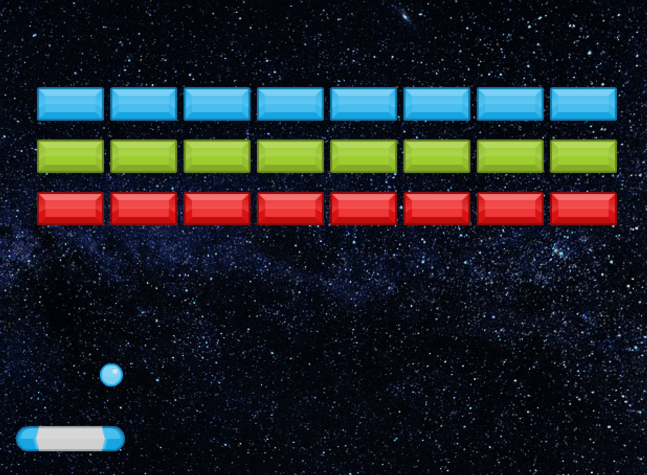
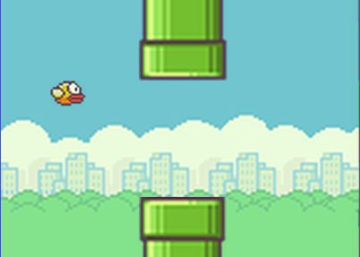

---
sidebar_custom_props:
  id: 2fc26040-4f21-41e1-b593-05941b1258da
---

import Grid from '@site/src/components/IFrame/Grid';

# Game-Projekt

:::info Ziel
- Ein Spiel selber nachbauen
- Das Konzept der Spieleprogrammierung verstehen
  - Was ist ein Game-Loop?
  - Wie lassen sich Zustände darstellen, speichern und verändern?
- Das Spiel anpassen und allenfalls erweitern
  - eigene Bilder und Sounds einbinden
  - für das eigene Gerät optimieren (Bildschirmgrösse, Tastaturbelegung, ...)
:::

:::cards --cols=3
***

👉 https://simplegametutorials.github.io/pygamezero/snake/
***

👉 [https://new.pythonforengineers.com](https://new.pythonforengineers.com/blog/your-first-game-in-python-in-less-than-30-minutes/)
***

👉 https://pygamezero-bird.readthedocs.io/en/latest/
:::


:::aufgabe Auftrag
1. Wählen Sie ein Spiel aus der Liste aus und geben Sie an, welches Sie ausgewählt haben:

    <div style={{display: 'flex', gap: '1em'}}>
    <Answer type="state" webKey="222d18e2-7faa-42c4-b71c-fe114e5d4362" states={['unset', 'checked']}>Snake</Answer>
    <Answer type="state" webKey="a1c64e63-c75b-4643-8ff1-395c3f6d9958" states={['unset', 'checked']}>Arcanoid</Answer>
    <Answer type="state" webKey="00916c68-1fbf-4e56-81bf-131af310cce9" states={['unset', 'checked']}>Flappy Bird </Answer>
    </div>

2. Starten Sie mit dem Tutorial und bauen Sie die einzelnen Schritte nach. Der Code soll nicht einfach kopiert werden, sondern verstanden und angepasst werden.
3. Der geschriebene Code soll kommentiert werden. Was macht der Code? Was ist die Funktion? Was ist der Zweck?
   ```py
    # Zur Erinnerung: In Python beginnt ein Kommentar mit einem Hashtag
   ```	
4. In jeder Doppelstunde nehmen Sie sich mindestens 10 Minuten Zeit, um im untenstehenden Tagebuch festzuhalten:
   1. Was Sie gemacht haben
   2. Welche Teile Sie umgesetzt haben
   3. Was Sie neues gelernt haben
   4. Ergänzungen und Verbesserungen beim Tutorial - gibt es Code-Teile, welche zusätzliche Kommentare brauchen? Schreiben Sie diese!

<Answer type="text" webKey="399ac141-992e-4442-ae34-5999697ade84" label="Woche 1" placeholder="Tagebuch ✍️..." /><br />
<Answer type="text" webKey="5f3991a2-a7e1-4596-9266-d697560df20b" label="Woche 2" placeholder="Tagebuch ✍️..." /><br />
<Answer type="text" webKey="5b34b27b-7fed-49f4-9e06-1fd20a0a14df" label="Woche 3" placeholder="Tagebuch ✍️..." /><br />

:::