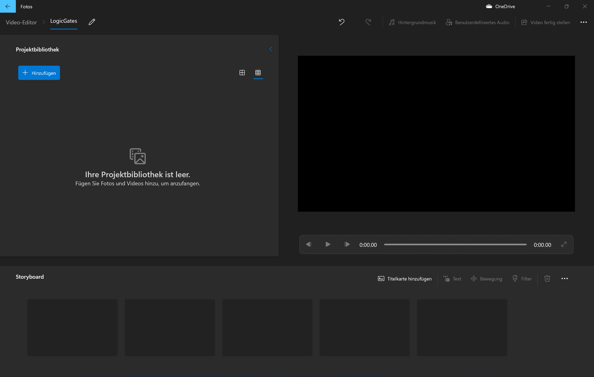
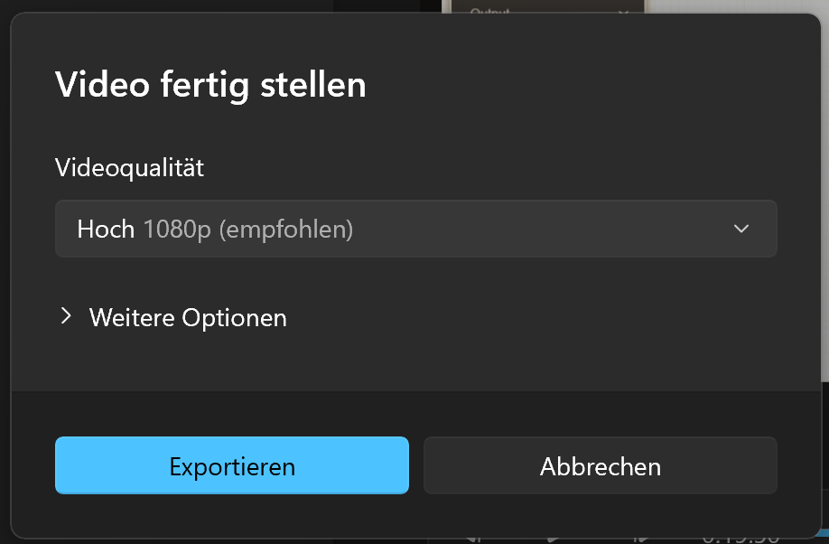

---
sidebar_custom_props:
  id: 4cc087b3-7cc8-478e-a947-841b63f0198e
---

# Videos Editieren

import OsTabs from '@site/src/components/OsTabs';

# Video Editieren

Es ist schwierig, ein komplettes Video am Stück zu drehen und dabei genug schnell alles vorzuzeigen, keine Fehler zu machen und aber auch die Zuschauer:innen nicht zu langweilen. Oft gibt es zudem mehrere **Szenen** oder "Drehorte" (können auch "Reale Welt" und "Screencast" sein). Deshalb muss ein Video oft nachbearbeitet und zusammengeschnitten werden.

Dazu kann unter Windows der Video-Editor in der Foto-App und unter Mac die iMovie App verwendet werden.

Um ein Video mit mehreren Szenen zusammenzuschneiden, kann wie folgt vorgegangen werden:
- **Video-Rohmaterial erstellen:** Wichtig ist primär das **Bildmaterial**, die **Tonspur** kann später noch aufgenommen und hinzugefügt werden.
- **Videos zuschneiden:** Ein Video Projekt erstellen, die verschiedenen Sequenzen hinzufügen, zuschneiden und fehlerhafte Teile entfernen.
- **Story erzählen: Videos anordnen**: Die einzelnen Clips so anordnen, dass die gewünschte Geschichte nachvollziehbar und spannend erzählt werden kann.
  - Langweilige/Technische Passagen schneller abspielen
  - Übergänge zwischen den Sequenzen hinzufügen - Achtung: oft lenken schlichte und relative schnelle Übergangseffekte weniger vom Inhalt ab als pompöse Effekte.
  - im Hinblick auf die folgende Vertonung des Videos: im Hinterkopf halten, wo es viel oder wenig Erklärungen braucht
- **Tonspur hinzufügen**: Überlegen Sie sich genau, was Sie mitteilen wollen und nehmen Sie anschliessend den Text auf. Vermeiden Sie störende Hintergrundgeräusche.
  - Wichtige Dinge können auch mit Text zusätzlich untermauert werden.
  - Für Teile ohne Sprache kann auch Musik verwendet werden. 
- **Exportieren des Videos**: Die einzelnen Videosequenzen, Bilder und Tonspuren zu einem Video zusammenfügen - dieser Prozess wird **Rendering** genannt.

Hilfreiche Links inkl. weiteren Anleitungen:
- [Windows Video-Editor](https://support.microsoft.com/de-de/windows/erstellen-von-filmen-mit-einem-video-editor-94e651f8-a5be-ae03-3c50-e49f013d47f6)
- [iMovie](https://www.apple.com/imovie/)

## Video Editor öffnen

<OsTabs>
<TabItem value="win">

Über die Fotos-App können auch Video-Projekte erstellt werden:

</TabItem>
<TabItem value="mac">

Unter Mac OS X muss die Software [iMovie 🔗](https://www.apple.com/de/imovie/) aus dem App-Store heruntergeladen werden.

</TabItem>
</OsTabs>

## Titel und Text

Zu Beginn eines Videos soll ein Titel angezeigt werden. Die mitwirkenden Personen werden entweder auch auf der Titelseite, oder aber im Abspann vermerkt.

Wichtige Aussagen im Video können zusätzlich mit Text untermauert werden. Die Dauer der Texteinblendung kann jeweils eingestellt werden und sollte min. `3s` dauern.

<OsTabs>
<TabItem value="win">

</TabItem>
<TabItem value="mac">

</TabItem>
</OsTabs>

## Zuschneiden und Aufteilen

Das Aufteilen von Videos ist besonders hilfreich, wenn
- fehlerhafte Teile entfernt werden sollen oder
- die Geschwindigkeit einzelner Teile verändert werden muss.

<OsTabs>
<TabItem value="win">

</TabItem>
<TabItem value="mac">

</TabItem>
</OsTabs>

### Wiedergabegeschwindigkeit

<OsTabs>
<TabItem value="win">

</TabItem>
<TabItem value="mac">

</TabItem>
</OsTabs>

## Tonspur

Ein Video besitzt normalerweise bereits eine Tonspur. Das Video kann aber auch neu vertont werden, indem neue Tonspuren hinzugefügt werden. Für jede Tonspur kann die Lautstärke individuell eingestellt werden. So lassen sich auch mehrere Tonspuren unterschiedlicher Lautstärke überlagern.

:::caution Hintergrundmusik
Die Tonspur mit gesprochenem Text soll immer klar und verständlich sein. Lieber verzichtet man auf eine durchgehende Hintergrundmusik, als dass dadurch die Klarheit Stimme leidet.
:::

<OsTabs>
<TabItem value="win">

Oben rechts "Benutzerdefiniertes Audio" wählen und anschliessend mehrere Audiodateien hinzufügen. Die Audiospuren lassen sich durch verschieben der Regler direkt zuschneiden. Die Tonspuren können auch überlagert werden.   

Durch Klicken auf das Lautsprechersymbol kann die Lautstärke für diese Tonspur eingestellt werden. Zudem kann eingestellt werden, ob die Tonspur direkt mit der gewählten Lautstärke abgespielt wird, oder ein Übergang verwendet wird.

</TabItem>
<TabItem value="mac">

Soll die Tonspur des Videos verändert werden, muss zuerst die Tonspur vom Video separiert werden: 

Um die Lautstärke der Tonspur zu ändern, kann die horizontale Linie in der Tonspur nach Oben/Unten verschoben werden. Zudem lassen sich die Lautstärken zu Beginn oder am Ende als Übergang Ein- bzw. Ausblenden.

</TabItem>
</OsTabs>

### Tonspuren aufnehmen

Gesprochener Text wird am besten direkt zum Abspielen des Videos aufgenommen.

<OsTabs>
<TabItem value="win">

Unter Windows wird zum Aufnehmen einer Tonspur das Programm [Sprachrekorder](https://support.microsoft.com/de-de/windows/verwendung-des-sprachrekorders-6fbb53d5-0539-abda-a9a4-0bcb84a778e7) benötigt.

Die gespeicherten Aufzeichnungen können anschliessend als Tonspur hinzugefügt werden.

</TabItem>
<TabItem value="mac">

In iMovie ist ein Sprachrekorder direkt eingebaut:

</TabItem>
</OsTabs>

## Exportieren

Ist das Video fertiggestellt, kann es als Videodatei exportiert werden. Beim exportieren wird die Darstellung jedes einzelnen Bildes *(für eine Sekunde Film sind es 30 Bilder)* berechnet, wobei Textüberlagerungen, Tondateien und Spezialeffekte zusammengefügt werden. Dieser Prozess kann sehr lange dauern und ist abhängig von der Geschwindigkeit der Grafikkarte. Dieser Prozess wird auch **Rendering** genannt.

<OsTabs>
<TabItem value="win">

Oben rechts auf "Fertig stellen" klicken und das Video abspeichern.

</TabItem>
<TabItem value="mac">

Oben rechts auf das "Teilen" Symbol klicken und "Datei exportieren" wählen.

</TabItem>
</OsTabs>
