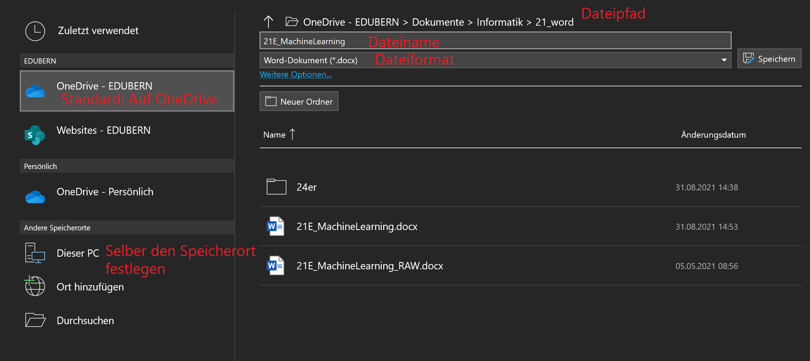
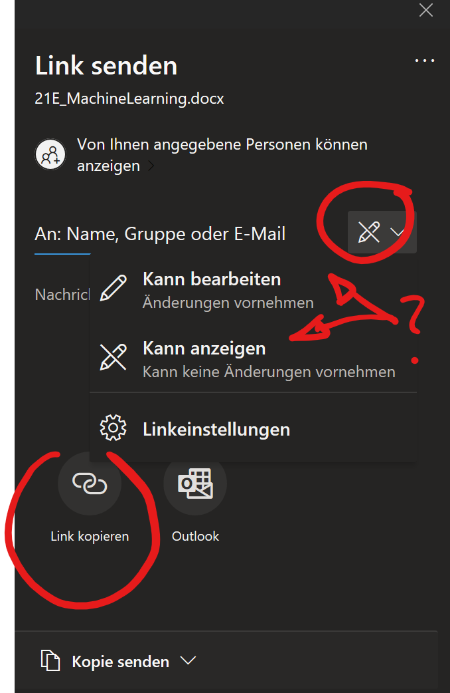

# Dateiformat

Jeder Computer hat ein Dateisystem, welches Dateien organisiert und auffindbar macht. Die Anleitung, wie eine Datei gefunden werden kann, heisst Dateipfad. Eine Datei besitzt einen Namen und ein Dateiformat. Die Dateiendung beschreibt das Dateiformat und gibt Auskunft über die Art von Daten, welche in einer Datei enthalten sind. So weiss Ihr Betriebssystem bspw. mit welchem Programm eine Datei geöffnet werden soll. Ein Word-Dokument hat die Dateiendung `.docx`.

```
 C:\Users\reto\OneDrive - EDUBERN\Informatik\01-Word\dokument.docx
└┬┘ └─┬──┘     └────────┬────────┘                   └─┬────┘ └─┬─┘
 |   Ordner         OneDrive                           |    Dateiformat
Laufwerk                                             Name
```

Wenn Sie in Word ein Dokument abspeichern, gibt es im wesentlichen zwei Möglichkeiten, die zum selben Ziel führen:



- das Dokument direkt auf **OneDrive** Speichern. Die Navigation zum richtigen Ordner kann etwas träge sein, da die Ordnerstruktur übers Internet direkt von OneDrive geladen wird.
- das Dokument wird auf dem **Computer** gespeichert - alle Möglichkeiten stehen offen - Sie können nach wie vor einen Ordner auf OneDrive auswählen.

Sofern ein OneDrive Ordner ausgewählt wurde, wird das Dokument automatisch synchronisiert.

## Gemeinsames Arbeiten

<div style={{width: '200px'}}>


</div>

Ein auf OneDrive gespeichertes Word-Dokument kann zur gemeinsamen Bearbeitung (z.B. für eine Gruppenarbeit) freiegegeben werden. Bei der Freigabe müssen Sie entscheiden, ob das Dokument nur betrachtet, oder auch bearbeitet werden darf:

<div className="no-table-header small-m">

|                             |                                |
| :-------------------------- | :----------------------------- |
|  |  |

</div>

:::caution Link Kopieren 📋
Erfahrungsgemäss funktioniert das Freigeben von Dokumenten am zuverlässigsten und am schnellsten, wenn der **Link** kopiert und per Teams verschickt wird. Die E-Mails bleiben manchmal etwas länger in einer Warteschleife bei Edubern hängen.

Beachten Sie, dass fürs Kopieren eines Links die Link-Einstellungen auf **Jeder mit dem Link** bzw. **Personen bei EDUBERN mit dem Link** gewählt werden muss.
:::

:::aufgabe Gemeinsames Arbeiten an einem Dokument

Gemeinsame Bearbeitung der Menüs fürs Klassenlager.

- Namen bei Ihrer Gruppe eintragen
- Menü-Vorschlag festhalten
- Bild vom Menü suchen und einfügen

[Menü-Klassenlager](https://erzbe-my.sharepoint.com/:w:/g/personal/balthasar_hofer_gbsl_ch/EZSz1D2J68pMuB_QaFrn83QBPHt7eDNtP8G5Vv7OppPUig?e=oBHa2n)

:::
