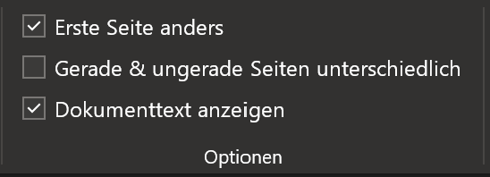
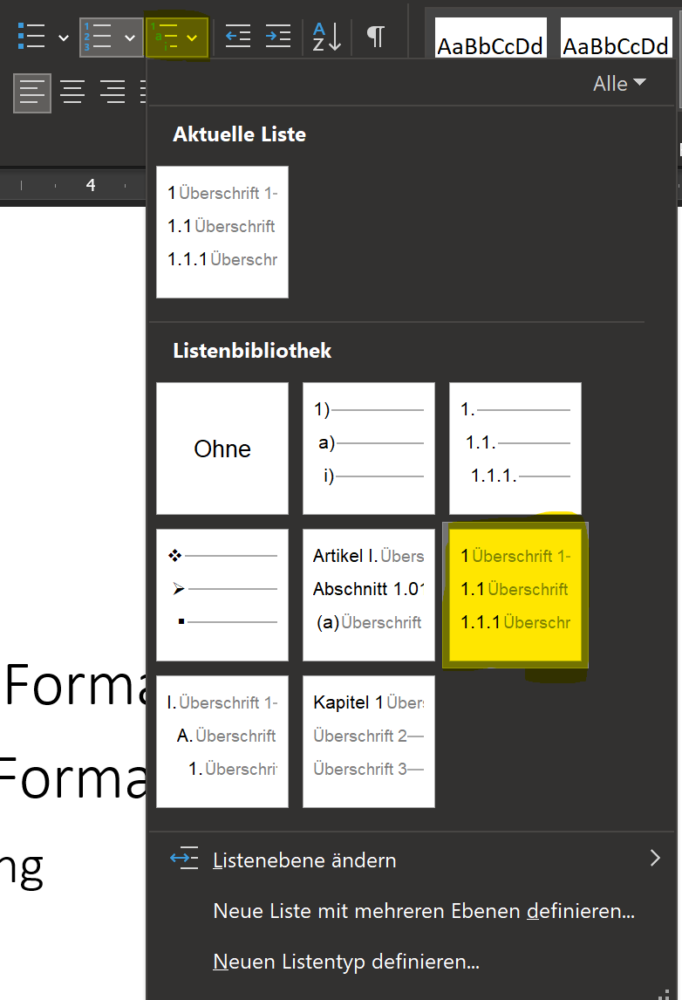
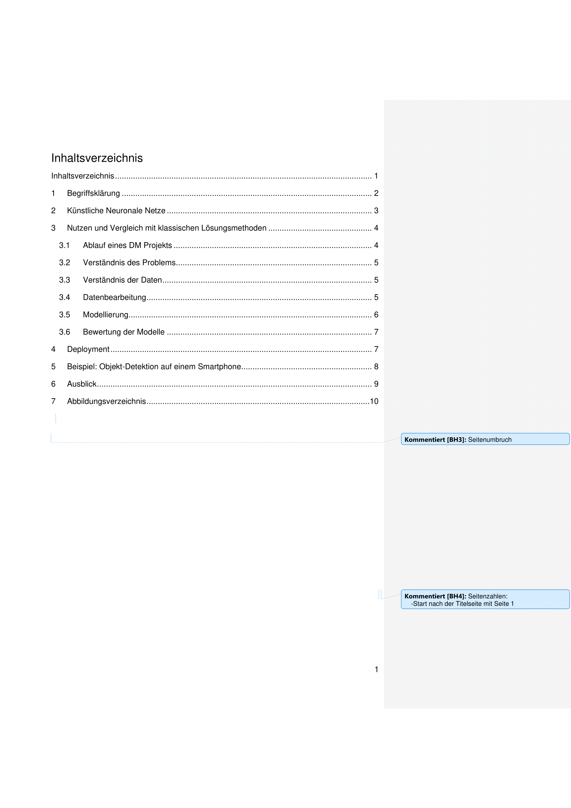
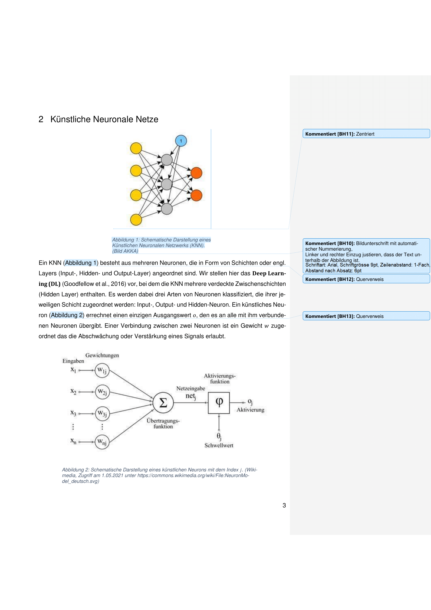

# Nummerierung und Bilder

In diesem Abschnitt lernen Sie, wie In Word
- Seiten
- Überschriften
- Abbildungen
nummeriert werden und wie auf solche nummerierten Elemente verwiesen werden kann.

## Seitenzahlen

Das Kopf- und Fusszeilen Menü öffnen (Doppelklick in den untersten Bereich eines Blattes, oder im Suchfeld "Fusszeile" eingeben).

Soll die erste Seite (bspw. Titelblatt) keine Seitenzahl erhalten, so kann das Häckchen "Erste Seite Anders" angewählt werden:

Über die Option "Seitenzahle formatieren..." kann bspw. das Seitenzahlformat (z.B. römische Zahlen) oder der Startwert festgelegt werden.

Die erste Seite, auch wenn "Erste Seite Anders" ausgewählt ist, zählt bei der Nummerierung auch dazu. Die Nummerierung muss also bei `0` starten, wenn die Seite nach dem Titelblatt die Seitenzahl `1` erhalten soll.

## Überschriften Nummerieren

Um Überschriften automatisiert nummerieren zu lassen, müssen die Überschriften als solche gekennzeichnet werden. Dies wird über die Zuweisung einer **Formatvorlage** erreicht ([Formatvorlagen](02-dokumentstruktur.md#absatz))

Die Formatvorlage für eine Überschrift kann geändert und über `Format > Nummerierung` eine Nummerierung hinzugefügt werden. 

### Geschachtelte Nummerierung

Soll eine verschachtelte Nummerierung eingefügt werden, muss
- zuerst der *Überschrift 1" eine eifache Nummerierung (wie oben) hinzugefügt werden
- der Cursor im Überschriften-Text fokussiert werden
- Über die "Liste mit mehreren Ebenen" die verschachtelte Nummerierung eingefügt werden

### Automatisches Inhaltsverzeichnis

Ein grosser Vorteil von zugewiesenen FOrmatvorlagen ist das Erzeugen von Verzeichnissen. Da Word nun "weiss", was einer Überschrift entspricht, lassen sich bspw. Inhaltsverzeichnisse autmatisch generieren und auf Knopfdruck auch aktualisieren.

## Bilder

### Layoutoptionen

## Übung

:::aufgabe

Laden Sie das Word-Dokument [ex02-machine-learning.docx](files/ex02-machine-learning.docx) herunter.

1. Verschieben Sie die Datei auf OneDrive in Ihren Informatik-Ordner.
2. Formatieren Sie Ihr Word-Dokument so, dass es am Ende wie in der Vorlage unten aussieht:

:::