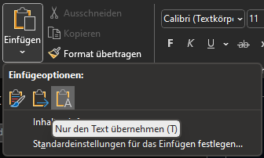
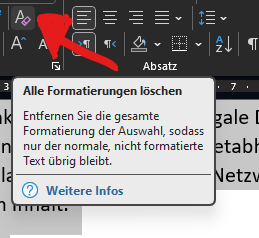
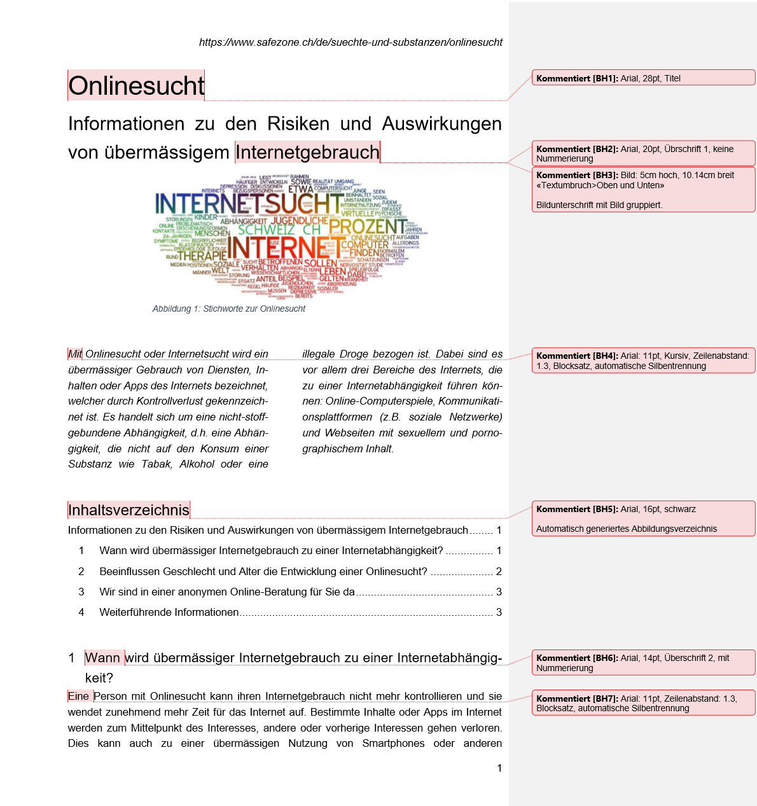
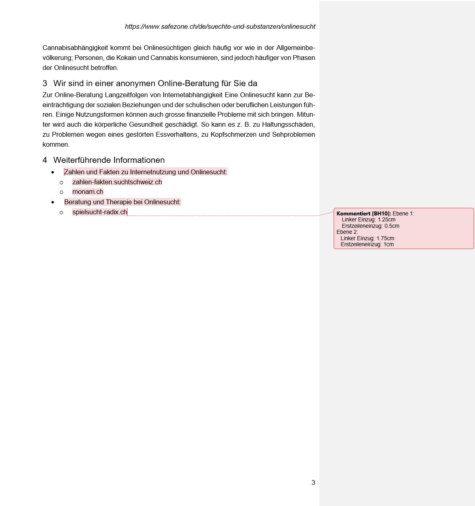

---
sidebar_custom_props:
  id: a0324f66-045f-4594-817b-9fba7042adf6
---

# Übung

Oft kommt es vor, dass mehrere Texte unterschiedlicher Quellen in ein Word-Dokument kopiert werden. Dabei ist es nervend, wenn auch spezielle Formatierungen oder sonderzeichen kopiert werden. Um nur den Inhalt einzufügen, kann in Word über __Einfügen > Nur den Text einfügen__ nur der pure Text und ohne Formatierungen übernommen werden. Natürlich werden dann Bilder nicht eingefügt.

Alternativ kann auch alles eingefügt werden und im Anschluss können bei ausgewähltem Text jegliche Formatierungen gelöscht werden.

:::aufgabe

Erstellen Sie ein Word-Dokument auf OneDrive mit dem Namen `03-onlinesucht.docx`.
Kopieren Sie den untenstehenden Text inkl. der Bilder und formatieren Sie das Dokument gemäss der Vorlage. Sind Angaben nicht näher spezifiziert, wählen Sie selber eine Formatierung, die der Vorlage möglichst nahe kommt.

:::

> Onlinesucht
> Informationen zu den Risiken und Auswirkungen von übermässigem Internetgebrauch
>
> Quelle: [https://www.safezone.ch/de/suechte-und-substanzen/onlinesucht](https://www.safezone.ch/de/suechte-und-substanzen/onlinesucht)
>
> 
>
> Mit Onlinesucht oder Internetsucht wird ein übermässiger Gebrauch von Diensten, Inhalten oder Apps des Internets bezeichnet, welcher durch Kontrollverlust gekennzeichnet ist. Es handelt sich um eine nicht-stoffgebundene Abhängigkeit, d.h. eine Abhängigkeit, die nicht auf den Konsum einer Substanz wie Tabak, Alkohol oder eine illegale Droge bezogen ist. Dabei sind es vor allem drei Bereiche des Internets, die zu einer Internetabhängigkeit führen können: Online-Computerspiele, Kommunikationsplattformen (z.B. soziale Netzwerke) und Webseiten mit sexuellem und pornographischem Inhalt.
>
> Inhaltsverzeichnis
>
> Wann wird übermässiger Internetgebrauch zu einer Internetabhängigkeit?
>
> Eine Person mit Onlinesucht kann ihren Internetgebrauch nicht mehr kontrollieren und sie wendet zunehmend mehr Zeit für das Internet auf. Bestimmte Inhalte oder Apps im Internet werden zum Mittelpunkt des Interesses, andere oder vorherige Interessen gehen verloren. Dies kann auch zu einer übermässigen Nutzung von Smartphones oder anderen internetfähigen, mobilen Geräten führen, mit Hilfe derer auf die gesuchten Inhalte zugegriffen oder online in sozialen Netzwerken kommuniziert wird.
>
> 
> 
> Es besteht ein unüberwindbares Verlangen nach internetbasierten Angeboten, die Nichtnutzung führt zu Nervosität und Entzugserscheinungen. Trotz negativer Folgen werden sie weiter genutzt oder konsumiert. Eine internetsüchtige Person zieht sich von anderen Menschen zurück und lässt Beziehungen abbrechen. Sie ist bis weit in die Nacht online, sodass sich der Tag-Nacht-Rhythmus verändert und sich eine übermässige Müdigkeit einstellt. Zeit im Internet zu verbringen kann auch eine Strategie sein, um unangenehme Gefühle oder Stress zu vermeiden. Nicht alle diese Anzeichen müssen bei einer Onlinesucht vorhanden sein. Eine Onlinesucht kann aber auch nicht allein aufgrund einer bestimmten täglichen Nutzungsdauer des Internets festgestellt werden - entscheidend ist der Verlust der Kontrolle über die Internetnutzung.
> Eine Internetabhängigkeit bringt biochemische Veränderungen im Körper mit, welche zur Sucht führen. Wie bei einer Drogenabhängigkeit kommt es auch bei der Onlinesucht zu Veränderungen im Belohnungszentrum des Gehirns, sodass der onlinesüchtigen Person alltägliche Belohnungssituationen allein nicht mehr ausreichen.
>
> Beeinflussen Geschlecht und Alter die Entwicklung einer Onlinesucht?
>
> 
>
> Jugendliche haben ein erhöhtes Risiko für eine Internetabhängigkeit oder Smartphone-Sucht, da die Gehirnregion, die für die Steuerung des Verhaltens und der Emotionen zuständig ist, noch nicht vollständig entwickelt ist. Frauen zeigen öfter eine übermässige Nutzung der Onlinekommunikation sowie sozialen Netzwerken, während Männer häufiger Probleme mit der übermässigen Nutzung von pornographischen Seiten (Online-Sexsucht) sowie Online-Computerspielen (Computerspielsucht) haben.
>
> Im Vergleich zur Allgemeinbevölkerung weisen Personen mit einer Onlinesucht häufiger eine Depression auf, sie sind introvertierter und haben ein geringeres Selbstwertgefühl. Eine Cannabisabhängigkeit kommt bei Onlinesüchtigen gleich häufig vor wie in der Allgemeinbevölkerung; Personen, die Kokain und Cannabis konsumieren, sind jedoch häufiger von Phasen der Onlinesucht betroffen.
>
> Wir sind in einer anonymen Online-Beratung für Sie da.
>
> Zur Online-Beratung
> Langzeitfolgen von Internetabhängigkeit
> Eine Onlinesucht kann zur Beeinträchtigung der sozialen Beziehungen und der schulischen oder beruflichen Leistungen führen. Einige Nutzungsformen können auch grosse finanzielle Probleme mit sich bringen. Mitunter wird auch die körperliche Gesundheit geschädigt. So kann es z. B. zu Haltungsschäden, zu Problemen wegen eines gestörten Essverhaltens, zu Kopfschmerzen und Sehproblemen kommen.
>
> Weiterführende Informationen zu Internetgebrauch und Onlinesucht
> Zahlen und Fakten zu Internetnutzung und Onlinesucht: [https://zahlen-fakten.suchtschweiz.ch](https://zahlen-fakten.suchtschweiz.ch); [https://monam.ch](https://monam.ch)
> Beratung und Therapie bei Onlinesucht: [https://spielsucht-radix.ch](https://spielsucht-radix.ch)
