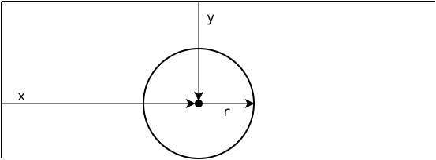
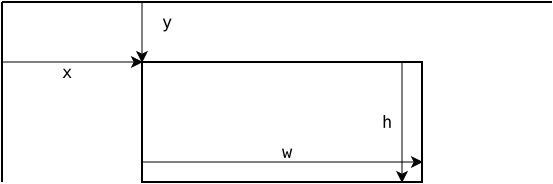

---
sidebar_custom_props:
  id: 0809a982-af24-41ce-bda7-6a92ae2eb41c
  source:
    name: Gym-Kirchenfeld
    ref: https://gitlab.gymkirchenfeld.ch/teach/ref/-/tree/main/pgzero
---
# Zeichnen
---

## Kreise

```py
screen.draw.circle((x, y), r, farbe)
```
zeichnet eine Kreislinie mit dem Mittelpunkt `(x, y)` und dem Radius `r` in der angegebenen Farbe. `farbe` muss ein RGB-Tupel sein.

```py
screen.draw.filled_circle((x, y), r, farbe)
```
zeichnet einen ausgefüllten Kreis mit dem Mittelpunkt `(x, y)` und dem Radius `r` in der angegebenen Farbe. `farbe` muss ein RGB-Tupel sein.



## Rechtecke

```py
Rect(x, y, w, h)
```
erstellt ein Rechteck-Objekt. Dabei sind `x` und `y` die Koordinaten der linken oberen Ecke, `w` ist die Breite und `h` die Höhe des Rechtecks.

```py
screen.draw.rect(rect, farbe)
```
zeichnet ein Rechteck in der angegebenen Farbe. Dabei ist `rect` ein Rechteck-Objekt, `farbe` muss ein RGB-Tupel sein.

```py
screen.draw.filled_rect(rect, farbe)
```
zeichnet ein ausgefülltes Rechteck in der angegebenen Farbe. Dabei ist `rect` ein Rechteck-Objekt, `farbe` muss ein RGB-Tupel sein.



## Linien

```py
screen.draw.line((x1, y1), (x2, y2), farbe)
```
zeichnet eine Linie vom Punkt `(x1, y1)` zum Punkt `(x2, y2)` in der angegebenen Farbe. `farbe` muss ein RGB-Tupel sein.

## Text

```py
screen.draw.text(text, left=x, top=y, fontsize=, fontname=, color=)
```
zeichnet den Text `text` an der angegebenen Position. Mit `fontsize=` kann die Schriftgrösse festgelegt werden. Die horizontale Ausrichtung des Texts wird durch `left=`, `centerx=` oder `right=` angegeben, die vertikale Ausrichtung durch `top=`, `centery=` oder `bottom=`:


Mit `fontname=` wird der Name einer Schriftart-Datei angegeben, welche im Unterverzeichnis **fonts** vorhanden sein muss. Mit `color=(r, g, b)` wird die Farbe angegeben.

Für die Angabe der horizontalen und vertikalen Koordinate muss je einer der obenstehenden Namen verwendet werden. Die folgende Anweisung zeichnet beispielsweise den Text «Hallo Welt» so, dass sich der Punkt (100, 100) unten und horizontal in der Mitte des Texts befindet:

```py
screen.draw.text("Hallo Welt", centerx=100, bottom=100, color=(255, 0, 0))
```
