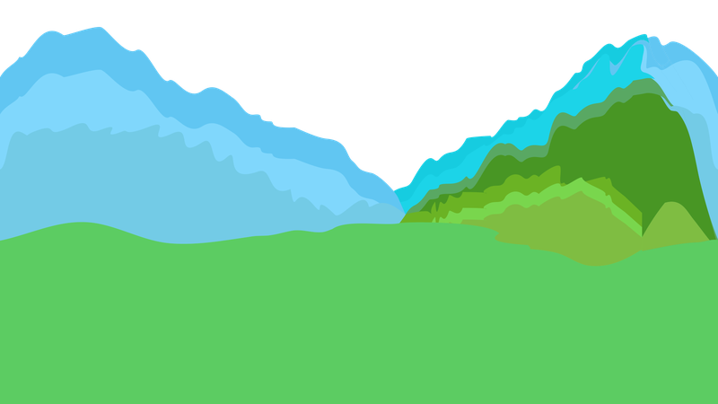
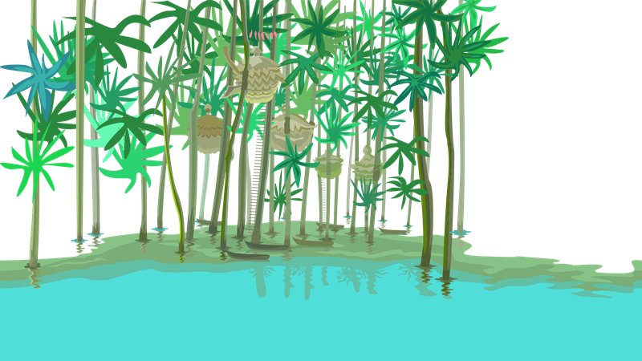
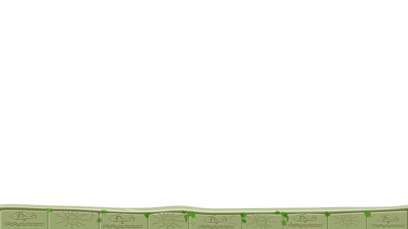

---
sidebar_custom_props:
  id: af21833c-ea74-44fc-a7f8-3a51ad52277e
  source:
    name: Gym-Kirchenfeld
    ref: https://gitlab.gymkirchenfeld.ch/teach/ref/-/tree/main/pgzero
---

import parallax_scrolling from './parallax_scrolling.raw.py';
import CodeBlock from '@theme/CodeBlock';

# Parallax-Scrolling
---

## Bilder

:::cards{columns=4}

::br

::br

::br

::br

::br

::br

::br{.empty}
:::

Bildquelle: [Craftpix.net, OpenGameArt][1], Lizenz: OGA

## Code

<CodeBlock language='python'>
{parallax_scrolling}
</CodeBlock>

[1]: https://opengameart.org/content/fairy-tale-2d-backgrounds
