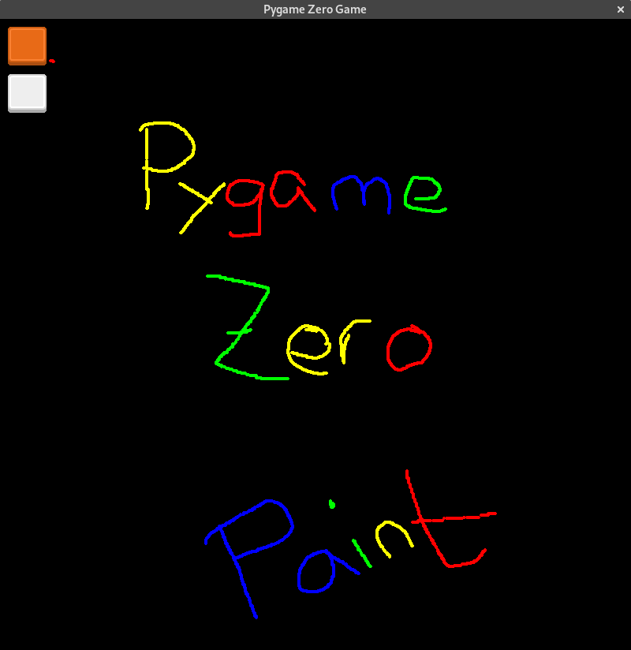

---
sidebar_custom_props:
  id: 96182e0c-3a6b-4eb0-8916-cc267904e1d3
  source:
    name: Gym-Kirchenfeld
    ref: https://gitlab.gymkirchenfeld.ch/teach/ref/-/tree/main/pgzero
---

import paint from './paint.raw.py';
import CodeBlock from '@theme/CodeBlock';

# Zeichenprogramm
---

## Beschreibung

Ein Zeichenprogramm

## Grafiken

## Programm

<CodeBlock language='python'>
{paint}
</CodeBlock>
