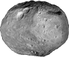
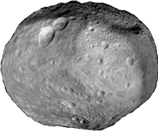
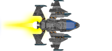

---
sidebar_custom_props:
  id: ccbea56e-16af-4567-b6e2-10a1d90db44b
  source:
    name: Gym-Kirchenfeld
    ref: https://gitlab.gymkirchenfeld.ch/teach/ref/-/tree/main/pgzero
---

import asteroids from './asteroids.raw.py';
import CodeBlock from '@theme/CodeBlock';

# Asteroids
---

## Grafiken

Quellen:
- Asteroid: [OhjiroChan, OpenGameArt][1], Lizenz: CC0
- Spaceship: [Rawdanitsu, OpenGameArt][2], Lizenz: CC0
- Laser and Thrust: [Rawdanitsu, OpenGameArt][3], Lizenz: CC0

## Programm

<CodeBlock language='python'>
{asteroids}
</CodeBlock>

[1]: https://opengameart.org/content/asteroid-tileset-01
[2]: https://opengameart.org/content/some-top-down-spaceships
[3]: https://opengameart.org/content/lasers-and-beams
