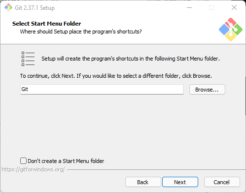
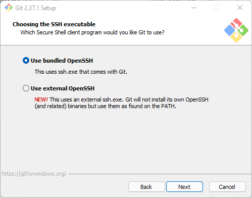

---
sidebar_custom_props:
  id: f989c844-97c0-4f04-b1d2-65c266cc862e
---

import OsTabs from '@site/src/components/OsTabs';

# Git 2.37.1

<Answer type="state" webKey="d24faf11-ba87-4e17-8e12-2fe834b60268">Installiert?</Answer>

👉 https://git-scm.com/downloads


<OsTabs os={['win', 'mac']}>
<TabItem value="win">


<GTabs getLabel={(idx) => `${idx + 1}.`} highlighted={[2,4,5,10,12]}>








</GTabs>

</TabItem>
<TabItem value="mac">

1. Installieren Sie `homebrew`, wenn es nicht bereits installiert ist
   1. Überprüfen: Öffnen Sie ein Terminal (suchen Sie nach `Terminal` bei Spotlight)
   2. Überprüfen Sie die Version von `homebrew` - wird eine angezeigt, haben Sie's installiert:

    ```bash
    brew --version
    ```
    3. Wenn keine Version angezeigt (bzw. sowas wie `zsh command not found`), installieren Sie [👉 homebrew](https://brew.sh/)
2.  Geben Sie ins Terminal 

    ```bash
    brew install git
    ```

    ein.
3. Überprüfen Sie, ob alles geklappt hat, indem Sie
    ```bash
    git --version
    ```
    in einem Terminal eintippen - wird eine Version angezeigt, war alles erfolgreich.

</TabItem>
</OsTabs>


## Git einrichten

Damit die Einrichtung von Git abgeschlossen ist, müssen wir den Namen und die Email-Adresse, welche für die Kennzeichnung von Commits verwendet wird, konfigurieren. Dies können wir in einer Git-Shell konfigurieren (auf Mac: im `Terminal`, auf Windows: in `Git Bash`).

Dort tippen Sie folgende Kommandos ein (wobei Sie natürlich Ihren Namen (oder Github-Nickname) anstatt `FooBar` verwenden, ebenso bei der Mail...)

```bash
git config --global user.name FooBar
git config --global user.email foo@bar.ch
```

Überprüfen obs geklappt hat:

```bash
git config --global user.name
git config --global user.email
```