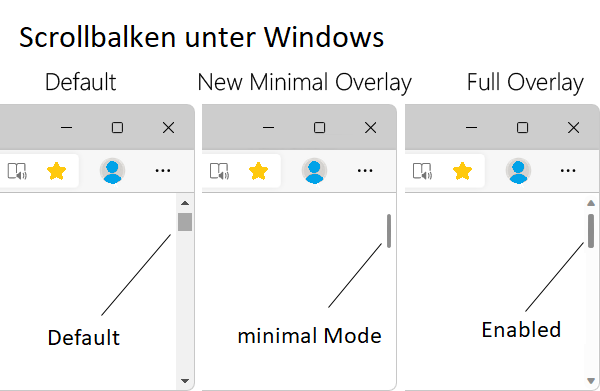

import BrowserWindow from '@site/src/components/BrowserWindow';

# Browser Scrollbalken

Unter Chrome :mdi-google-chrome--blue:, Edge :mdi-microsoft-edge--cyan: und Firefox :mdi-firefox--orange: gibt es eine versteckte Einstellungsseite, in welcher jegliche Einstellungen des Browsers konfiguriert werden kann.

<!--truncate-->

:::danger Achtung
Ändern Sie nur Einstellungen deren Auswirkungen Sie kennen!
:::

## Scrollbars
Die Scrollbars sehen unter Windows teils etwas altbacken aus, damit Sie auf allen Gerätekategorien und für alle Benutzer:innen gut benutzbar sind. Dies kann aber auch nervig sein, da durch die Scrollbars viel Platz verloren geht. Über die versteckte Einstellungsseite lässt sich das Aussehen ändern

<BrowserWindow url="edge://flags" browser="edge" copy>

Edge :mdi-microsoft-edge--cyan:
: **Einstellungsseite** 👉 `edge://flags`
Aussehen der Scrollbar
: `edge://flags/#edge-overlay-scrollbars-win-style`
Flüssiges Scrollen
: `edge://flags/#smooth-scrolling`

</BrowserWindow>

<BrowserWindow url="chrome://flags" browser="chrome" copy>

Chrome :mdi-google-chrome--blue:
: **Einstellungsseite** 👉 `chrome://flags`
Aussehen der Scrollbar
: `chrome://flags/#overlay-scrollbars`
Flüssiges Scrollen
: `chrome://flags/#smooth-scrolling`

</BrowserWindow>

<BrowserWindow url="about:config" browser="firefox" copy>

Firefox :mdi-firefox--orange:
: **Einstellungsseite** 👉 `about:config`
Scrollbars
: Standardmässig aktiviert ✅

</BrowserWindow>
