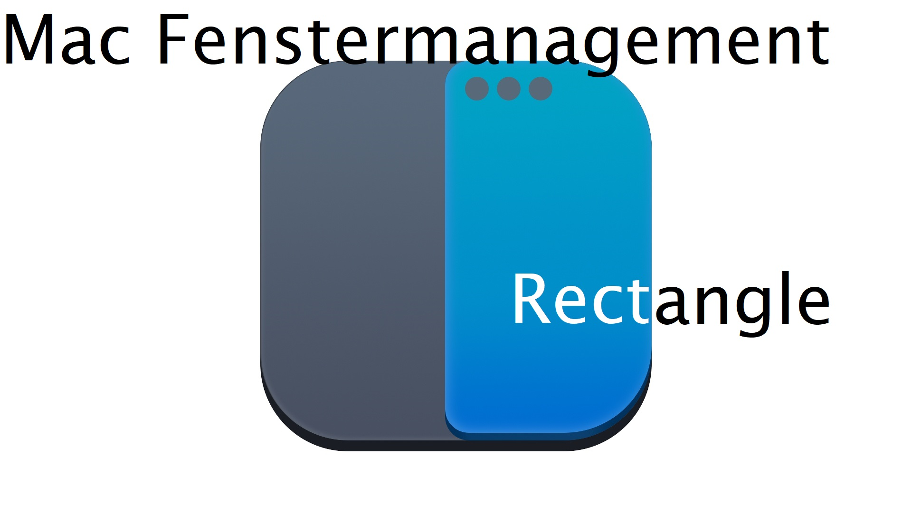

# Fenstermanagement unter Mac

Unter :mdi[apple]{.black} Mac gibt es standardmässig keine Möglichkeit, Fenster auf dem Bildschirm optimal zu positionieren, ohne dabei in den Vollbildschirm Modus zu wechseln. 

](images/rectangle.gif)

<!--truncate-->

Gerade wenn oft zwischen Programmen gewechselt werden soll, wäre dies aber praktisch.

Das kostenlose und quelloffene Programm [👉 rectangleapp](https://rectangleapp.com/) übernimmt diese Aufgabe im nu und rüstet somit die aus Windows bekannte Funktion nach.

Die Anordnung der Fenster kann dabei bequem mit Tastenshortcuts vorgenommen werden:

Viel spass damit 😎

