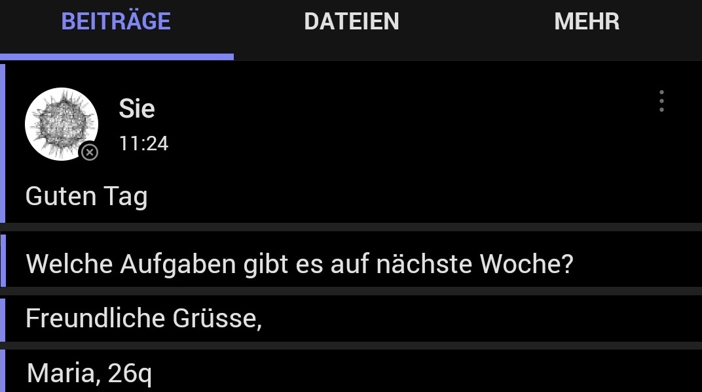

# Neue Zeile ohne Nachricht abzuschicken

#### :mdi-microsoft-teams--blue: :mdi[whatsapp]{.green} :mdi[instagram]{.red}

Kurz eine Nachricht schreiben - Anrede, Text, Grussformel... Doch [[:mdi-keyboard-return:]] schickt die Anrede ab, anstatt eine neue Zeile einzufügen 😖 ...

{/* truncate */}

Egal ob in Word, MS-Teams, Whatsapp oder Instagram: Soll eine neue Zeile erzeugt werden, welche noch zum vorigen Abschnitt oder zur selben Nachricht gehört, so kann dies mit [[:mdi-apple-keyboard-shift:]] + [[:mdi-keyboard-return:]] erreicht werden.

