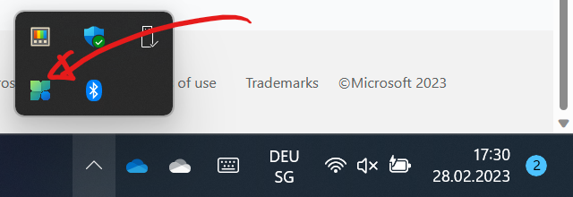

# PC Manager 🚀

Dein :mdi[microsoft-windows]{.blue}-Laptop ist plötzlich langsamer als gewohnt? Der PC-Manager verleiht deinem Gerät einen Boost 🚀.

{/* truncate */}

👉 https://pcmanager-en.microsoft.com/

Ein offizielles Tool von Microsoft, welches die Leistung eines Windows-PCs verbessern kann, indem temporäre Dateien, die aktuell nicht benötigt werden, gelöscht werden. Zudem kann leicht festgestellt werden, welche Programme am meisten Rechenleistung verbrauchen und diese können bei Bedarf auch geschlossen werden.

Einmal installiert, kann der PC-Manager unten Rechts in der Task-Liste geöffnet werden.

