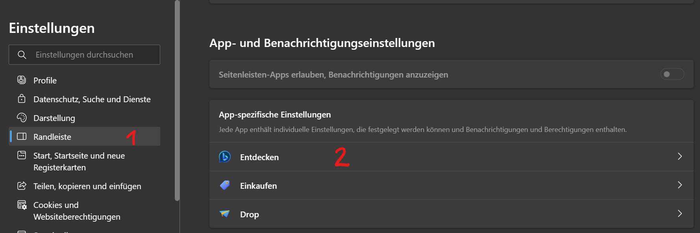

import BrowserWindow from '@site/src/components/BrowserWindow';

# Bing Button entfernen

#### :mdi-microsoft-edge--cyan: :mdi-microsoft--blue:

Der prominente Bing-Knopf in Edge loswerden? So gehts...

<!-- truncate -->

In den Einstellungen :mdi-cog: von Edge :mdi-microsoft-edge: unter __Randleiste > Entdecken__ die Einstellung __Entdecken anzeigen__ abschalten.

### Direkter Link zu den Einstellungen

Die URL `edge://settings/sidebar` per Copy-Paste in die Adresszeile einfügen.

<BrowserWindow url="edge://settings/sidebar" browser="edge" copy>

__Entdecken > Entdecken anzeigen :mdi-toggle-switch-off-outline:__

</BrowserWindow>