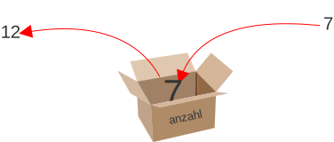
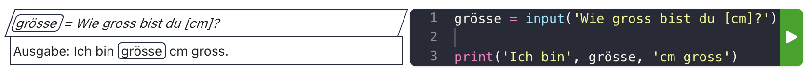

# Zügelboxen

- Enthalten einen Inhalt
- Beschriften
- Wiederverwendung


## Zügelboxen
Inhalt + Beschriftung


## Zügelboxen
Wiederverwenden



## Variablen


```py
anzahl = 12
print(anzahl)
```


## Variablen


```py
anzahl = 12
print(anzahl)
anzahl = 7
print(anzahl)
```


## Variablen


```py
anzahl = 12
print(anzahl) # => 12
anzahl = 7
print(anzahl) # => 7
```


## Mit Variablen rechnen

```py
anzahl = 12
print(anzahl + 13)
```


## Mit Variablen rechnen

```py
anzahl = 12
print(anzahl + 13) # => 25
```


## Mit Variablen rechnen

<div class="small">

```py
anzahl = 12
gewicht = 100
print(f'{anzahl} Tafeln Schokolade sind {anzahl * gewicht} g schwer')
```

</div>


## Mit Variablen rechnen

<div class="small">

```py
anzahl = 12
gewicht = 100
print(f'{anzahl} Tafeln Schokolade sind {anzahl * gewicht} g schwer')
# => 12 Tafeln Schokolade sind 1200 g schwer
```

</div>


# Formatierter Text
Variablenwerte lassen sich mit geschweiften Klammern `{}` in einen Text einfügen.

```py
name = 'Alfred'
print(f'Hallo {name}') # => Hallo Alfred
```


## Variable: Struktogramm

Variablen werden **umrandet**.

<div class="full">


</div>


## Was passiert hier?

```py
anzahl = 2

anzahl = anzahl + 7
print(anzahl)

anzahl = anzahl + 5
print(anzahl + 1)
```


## Was passiert hier?

```py
anzahl = 2

anzahl = anzahl + 7
print(anzahl) # => 9

anzahl = anzahl + 5
print(anzahl + 1) # => 15
```


# Benutzereingaben

- Interaktion mit Benutzer:innen
- `input` erzeugt ein Eingabefenster
- Die Antwort kann in einer Variable gespeichert werden

```py
alter = input('Wie alt bist du?')
print(f'Ich bin {alter} Jahre alt.')
```


# Struktogramm

Eingaben werden in einem **Parallelogramm** dargestellt.
<div class="full">



</div>


## Mit Eingaben rechnen

- Benutzereingaben liegen als **Text** vor
- Zahlen müssen zuerst umgewandelt werden:
  - Ganze Zahlen: `int`
  - Dezimalzahlen: `float`

```py
anzahl = input('Wie viele Strecken soll die Spirale haben?')
anzahl = int(anzahl)
seite = 10
for i in range(anzahl):
    forward(seite)
    left(90)
    seite = seite + 10
```
