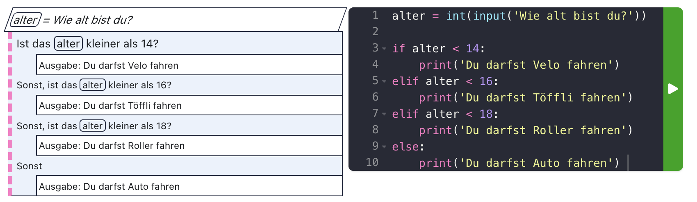

# Bedingte Ausführung ⑂

Einer oder mehrere Schritte werden nur ausgeführt, wenn eine bestimmte Bedingung erfüllt ist.


## Vergleichen

Vergleiche sind die Basis der Entscheidung, ob ein Codeblock ausgeführt wird, oder nicht.

Ein Vergleich kann immer als Frage gestellt werden, die mit **Ja** oder **Nein** beantwortet werden kann.


## Beispiel

- Ist das alter kleiner als 14?

```py
alter = int(input('Wie alt bist du?'))

if alter < 14:
    print('Du darfst Velo fahren')
else:
    print('Du darfst Töffli fahren')
```


## Beispiel
Weitere Optionen hinzufügen

```py
alter = int(input('Wie alt bist du?'))

if alter < 14:
    print('Du darfst Velo fahren')
elif alter < 16:
    print('Du darfst Töffli fahren')
else:
    print('Du darfst Roller fahren')
```


## Beispiel
Noch mehr Optionen...

```py
alter = int(input('Wie alt bist du?'))

if alter < 14:
    print('Du darfst Velo fahren')
elif alter < 16:
    print('Du darfst Töffli fahren')
elif alter < 18:
    print('Du darfst Roller fahren')
else:
    print('Du darfst Auto fahren')
```


## Struktogramm

<div class="full">



</div>


# Ausgabe mit `alert``

```py
from browser import alert

alter = int(input('Wie alt bist du?'))
alert(f'In einem Jahr bist du {alter + 1} jährig.')
```