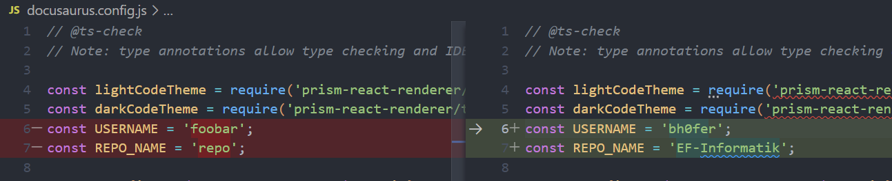
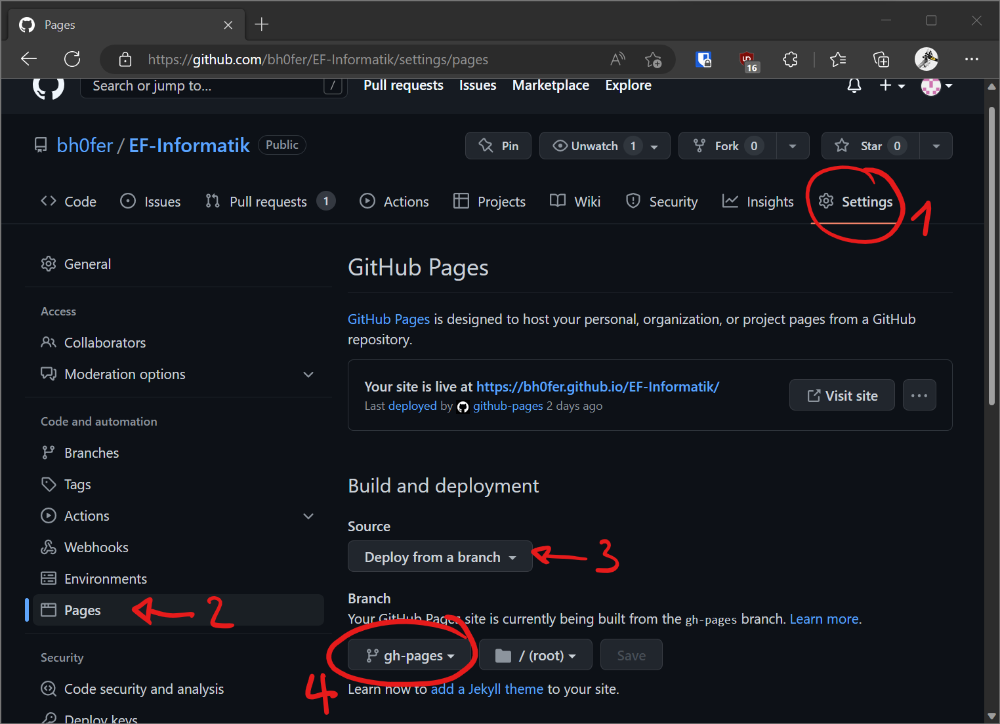

---
sidebar_custom_props:
  id: e653a077-4d2c-4323-9ea6-6594d7609ae1
---
import SearchBox from '@site/src/components/SearchBox';
import BrowserWindow from '@site/src/components/BrowserWindow';

# Docusaurus v2.2.0


[Docusaurus](https://docusaurus.io/) ist ein praktisches Dokumentations- und Blog Framework, welches ein Projekt in eine Website verwandelt.

> In general, a framework is a real or conceptual structure intended to serve as a support or guide for the building of something that expands the structure into something useful.

Ein Framework gibt also immer eine geiwsse Struktur vor, damit es funktionieren kann. Im vorliegenden Fall müssen wir uns an die vorgegebene (bzw. konfigurierte)  Ordner-Struktur, damit das Framework autmatisiert aus all unseren Markdown-Dokumenten eine Webseite erstellt.

```bash
EF-Informatik # Github Repository Ordner
├── blog        # Blog Einträge
│   ├── 2022-08-26-wiedereinstieg-python.md
│   └── 2022-11-07-about-software-engineering
│       ├── images  # enthält alle Bilder für diesen  Blog
│       |   ├── top-down.png
│       |   └── bottom-up.png
│       └── index.md      # erzeugt die Seite /2022/11/07/about-software-engineering
├── docs
│   ├── greeting.md  # erzeugt die Seite /docs/greeting
│   └── guide
│       ├── index.md  # erzeugt die Seite /docs/guide
│       └── setup.md    # erzeugt die Seite /docs/guide/setup
├── src
│   └── pages
|       ├── ... # wie bei den blogs, nur werden diese Seiten nirgends direkt angezeigt,
|               # man muss die URL kennen...
├── docusaurus.config.js
├── ...
```

In Ihrem Github-Repository brauchen Sie die Ordner __blog__ und __docs__, jeweils mit mindestens einem Eintrag.

:::aufgabe Anleitung

<Answer type="state" webKey="a1d16f50-2452-465b-b546-93c9eb0d89fd" />

Material
: Vorkonfigurierte Dateien für Docusaurus v2.2.0 [👉 Herunterladen](assets/docusaurus.zip)

1. Uncommitete Änderungen? :mdi-arrow-right: Commit & Push.
2. [Material](assets/docusaurus.zip) herunterladen, entpacken und den ganzen Inhalt in Ihr Repository kopieren. Das sollte dann in etwa so aussehen:

  

  :::danger Wichtig
  Die Datei __docs/about-me.md__ und den Ordner __blog__ braucht es zwingend, sonst versucht Docusaurus etwas zu suchen, was nicht existiert (:mdi-arrow-right: Docusaurus Traurig :mdi-arrow-right: Sie traurig :mdi-emoticon-cry:)
  :::

3. Github-Benutzername und Name des Repository in __docusaurus.config.js__ ändern.

  

4. Alle Änderungen hinzufügen, Commit & Push.
5. Die Seite wird automatisch erzeugt und auf Github veröffentlicht. Es dauert jeweils 1-5 Minuten (☕...), bis dies geschehen ist. Um die Webseite auch unter einer URL abrufbar zu machen, muss unter __Settings > Pages > Branch > gh-pages__ **Github Pages** aktiviert werden.

  

  :::caution Private Repositories
  Bei kostenlosen Accounts können nur öffentliche Repositories als Website zugängig gemacht werden. Unter __Settings > General > Danger Zone (zuunterst auf der Seite)__ kann die Sichtbarkeit geändert werden (*Change repository visibility*).
  :::

5. Wird danach noch keine URL angezeigt, können Sie durch einen neu gepushten Commit bezwecken, dass die Seite neu erzeugt wird und anschliessend abrufbar ist. 
:::


## Individualisieren

Natürlich kann die Website nach den eigenen Wünschen individualisiert werden. Die grössten Effekte haben die Websitenfarbe und das Logo.

### Farben

Docusaurus arbeitet mit zwei Hauptfarben - eine für den Light-Mode und eine andere für den Dark-Mode. Damit das Design konsistent wirkt, braucht es von den Hauptfarben eine ganze Farbreihe von 7 Abstufungen.

Mit diesem [👉 Tool](https://docusaurus.io/docs/styling-layout#styling-your-site-with-infima) lassen sich diese Abstufungen einfach erzeugen.


Der Code-Teil muss kopiert und im CSS-File __src/css/custom.scss__ ersetzt werden:


### Logo

Im Ordner __static/img/__ befinden sich die beiden Bild-Dateien `logo.svg` und `favicon.ico`.

Das Logo sollte quadratisch sein, und nicht mehr als 300kb gross sein.  Falls Sie selber gerade kein inspirierendes Logo im Kopf haben: Ein Logo kann mit kostenlosen Webapps leicht zufällig auf Basis einiger Stichwörter erzeugt werden (dazu braucht es kein all zu grosses künstlerisches Flair 😉). Suchen Sie nach einem entsprechenden Logo Generator...

<BrowserWindow url="https://google.com">

<SearchBox>

free Logo Generator
</SearchBox>

</BrowserWindow>

Ersetzen Sie das vorhandene Logo durch das neue. Falls das neue Logo nicht die Dateiendung `.svg` aufweist, so müssen Sie dies im Konfigurationsfile __docusaurus.config.js__ entsprechend anpassen gehen:


Das `favicon.ico` ist das kleine Bildchen oben links in einem Browser-Tab. Dies kann auf Basis Ihres Logos leicht erzeugt werden.

<BrowserWindow url="https://google.com">

<SearchBox>

png to ico
</SearchBox>

</BrowserWindow>


## Website Lokal ausprobieren

Um die Website lokal auszuprobieren, muss zuerst [NodeJS](https://nodejs.org/) installiert und konfiguriert werden. Anschliessend kann die Seite lokal gestartet und unter der Lokalen Netzwerkadresse beim Port 3000 ([localhost:3000](http://localhost:3000)) gefunden werden.

:::aufgabe Anleitung für die Installation
1. NodeJS LTS mit den Standard-Optionen installieren (vermutlich x64) 👉 https://nodejs.org/en/download/
2. In VS-Code unter __Terminal>New Terminal__ ein neues Terminal öffnen und überprüfen, ob Node installiert wurde (sollte die aktuelle Version ausgeben):

  ```bash
  node --version
  ```

  Falls es nicht verfügbar ist: Laptop neu starten und erneut versuchen (vlt. wurde es einfach nicht gefunden...)
3. Den Paket-Manager `yarn` installieren, indem in die Kommandozeile/Terminal folgendes eingegeben wird:

  ```bash
  npm install --global yarn
  ```

4. Nun müssen alle Pakete für Docusaurus installiert werden:
   ```bash
   yarn install
   ```
5. Und schliesslich Dokusaurus mit einem lokalen Server starten
  ```bash
  yarn run start
  ```
  Die Seite ist nun unter 👉 [http://localhost:3000](http://localhost:3000) erreichbar.  

  Mit [[ctrl]] + [[c]] kann der lokale Server wieder beendet werden.


Änderungen an Markdowns werden direkt übernommen, ohne den Server neu zu starten oder die Webseite neu zu laden.
:::