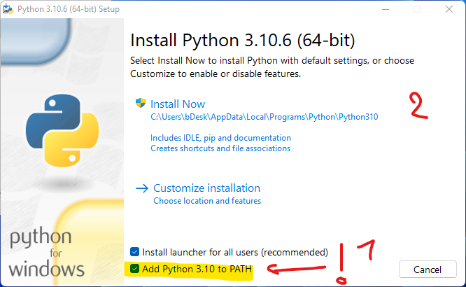
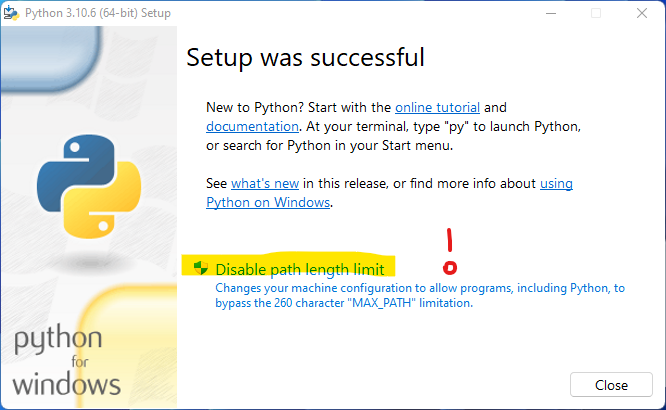

# Python 3.10.6 :mdi-language-python--blue:

👉 https://www.python.org/

1. Den Python-Installer für Ihre Platform herunterladen (Version 3.10.6)
2. Python-Installer ausführen
3. Installation überprüfen:
   1. Öffnen Sie __Python 3.10__ (Python Shell)
   2. Geben Sie zum Test
   
    ```py
    a = 10 + 3
    print(a)
    ```
    ein.
   3. Überprüfen Sie das Resultat... 


<GTabs getLabel={(idx) => `${idx + 1}.`} highlighted={[0,1]}>






</GTabs>
