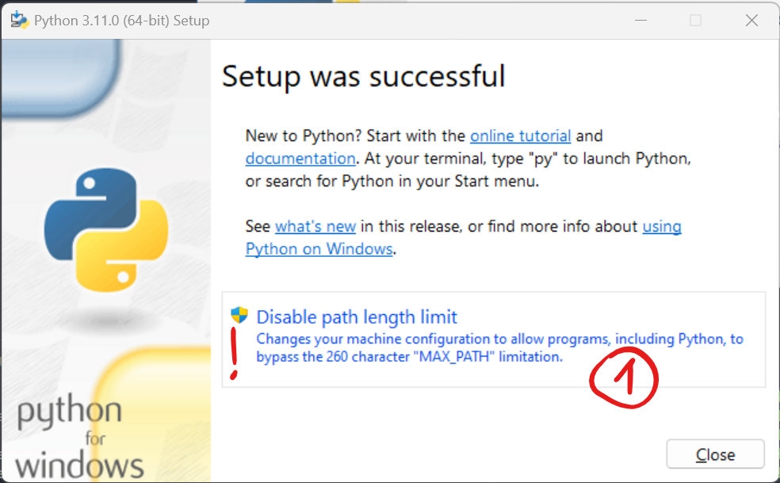
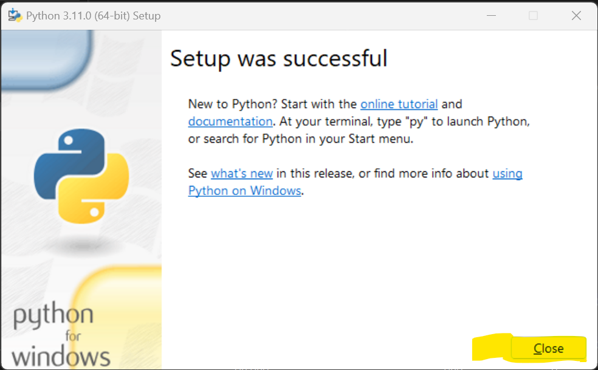

# Python 3.11.0 :mdi[language-python]{.blue}

👉 https://www.python.org/

1. Den Python-Installer für Ihre Platform herunterladen (Version 3.11.0)
2. Python-Installer mit folgenden Optionen ausführen

<GTabs getLabel={(idx) => `${idx + 1}.`} highlighted={[0,1]}>

![:mdi[flash-triangle]{.orange} Python zum Pfad hinzufügen!](images/py-1.png)




</GTabs>

3. Installation überprüfen:
   1. Öffnen Sie __Python 3.11__ (Python Shell)  

   

   1. Geben Sie zum Test
   
    ```py
    a = 10 + 3
    print(a)
    ```
    ein.
   2. Überprüfen Sie das Resultat... 