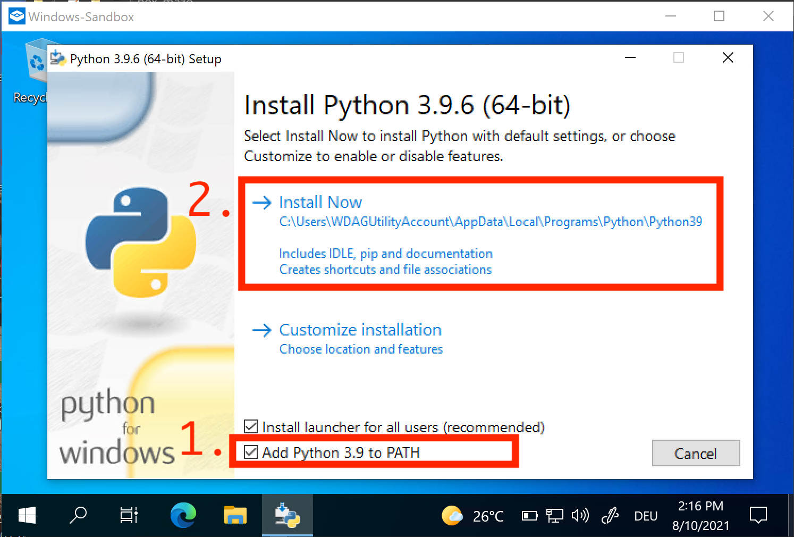
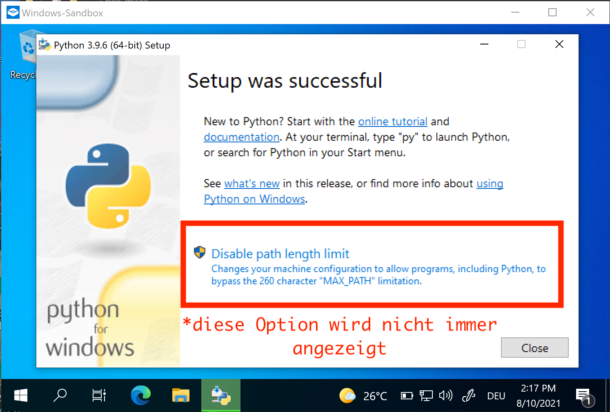
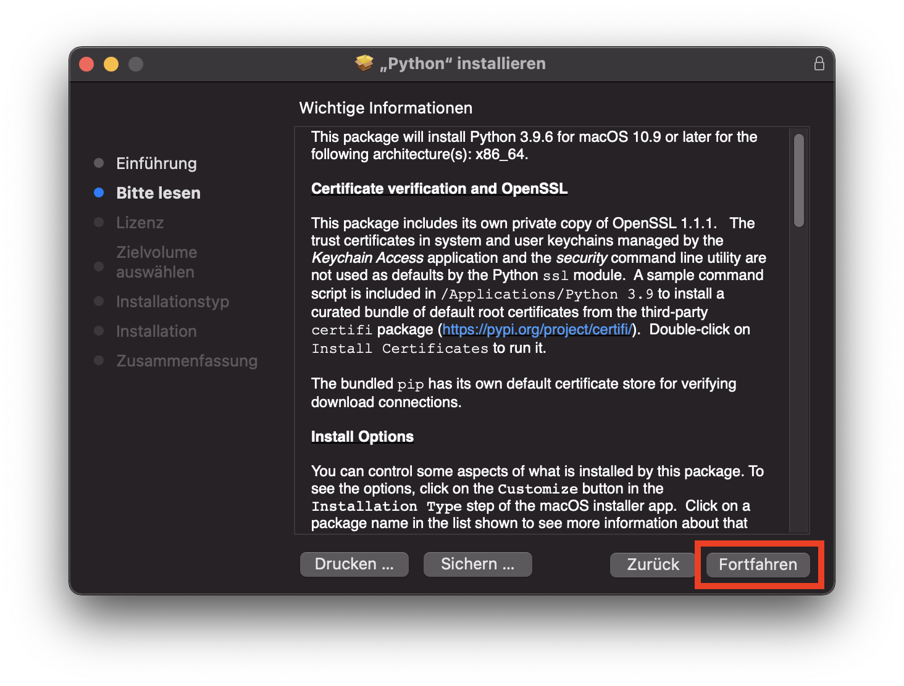
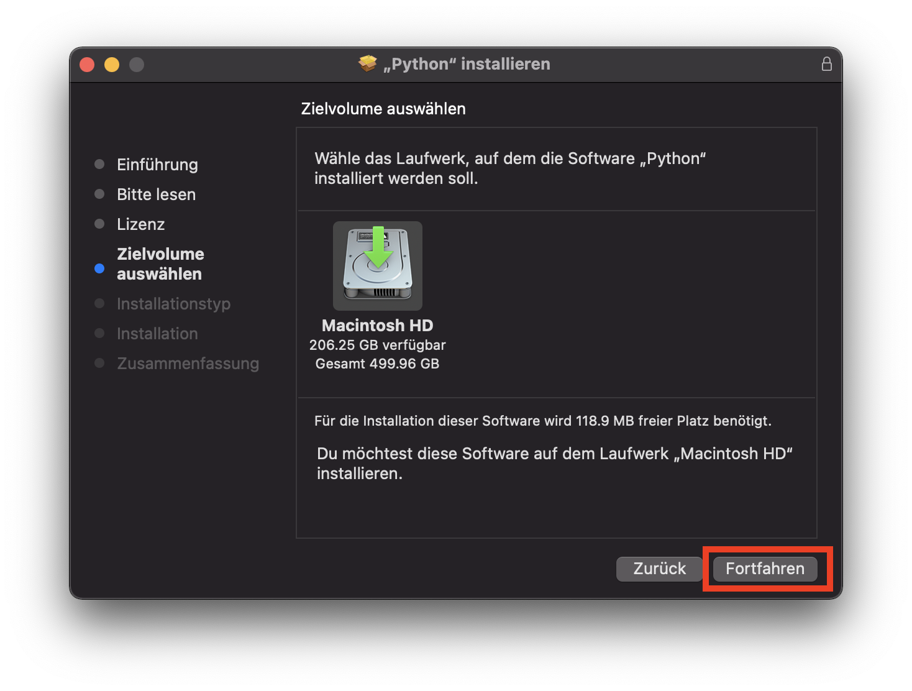

---
sidebar_custom_props:
  id: c9ac425b-88bc-4c7e-a1bb-2a6940d7ab84
---
import OsTabs from '@site/src/components/OsTabs';

# Python 3.9

1. Unter [https://www.python.org/](https://www.python.org/) die aktuelle Version von Python herunterladen.
2. Die heruntergeladene Datei doppelklicken (Dateiendung unter Windows `.exe`, unter Mac OSX `.pkg`)
3. Folgende Optionen bei der Installation berücksichtigen:

<OsTabs>
<TabItem value="win">

1. Schritt: 
2. Schritt: Warten... 
3. Schritt: Falls die Option zum Entfernen des Pfadlängenlimits angezeigt wird: 
4. Schritt: 
5. Fertig 🥳

</TabItem>
<TabItem value="mac">

1. Schritt: 
2. Schritt: 
3. Schritt: 
4. Schritt: 
5. Schritt: 
6. Schritt: 
7. Schritt: 
8. Schritt: Warten... 
9. Fertig 🥳

</TabItem>
</OsTabs>
