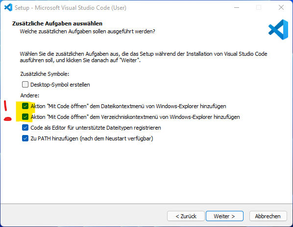
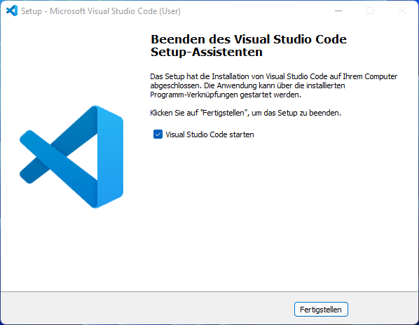

---
sidebar_custom_props:
  id: 86626f26-ece4-4b76-88e7-e9ac1d1a13ec
---

# VS Code 1.70

👉 https://code.visualstudio.com/

<GTabs getLabel={(idx) => `${idx + 1}.`} highlighted={[3]}>

</GTabs>

:::details[Empfohlene Erweiterungen und Einstellungen]
#### Erweiterungen
- python
- Intelli Code
- git-graph

#### Einstellungen
- `debug.inlineValues` auf 'on'
:::