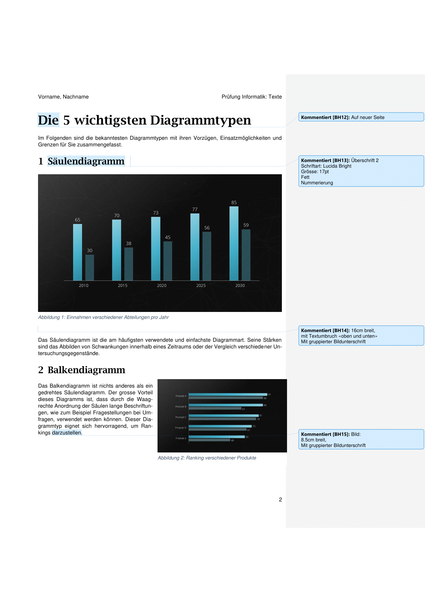
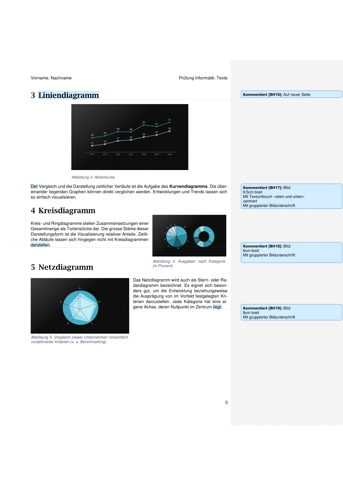

import styles from "./styles.module.scss";

# Textdokumente

[Vorlage: p01-diagramme.docx](images/25h/p01-diagramme.docx)

<a className="button button--success" href="https://erzbe-my.sharepoint.com/:f:/g/personal/balthasar_hofer_gbsl_ch/Eo6tLAJ4EP9PtO9lGspD77oBGGiMXiRBXC7XAvFIUugxLQ">Hochladen</a>

---

