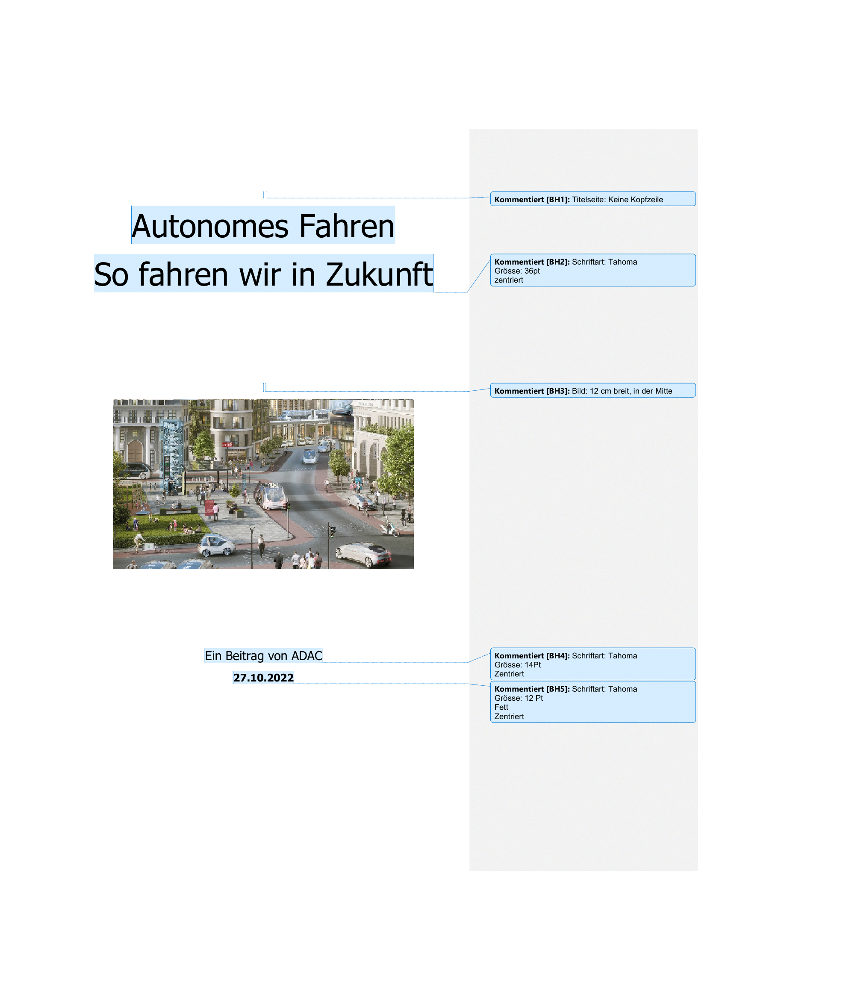
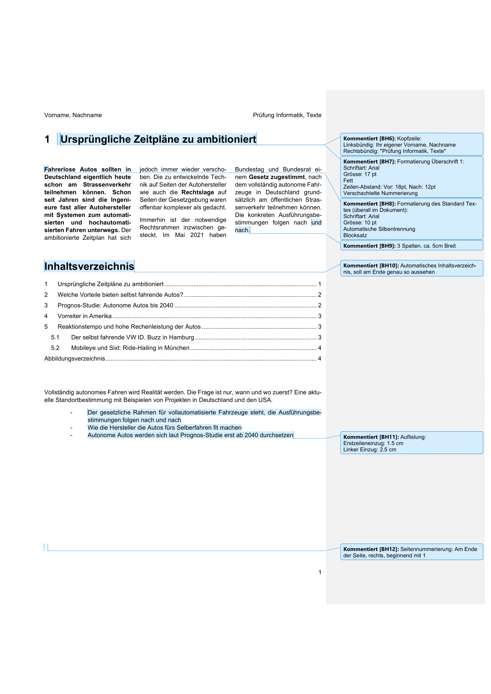
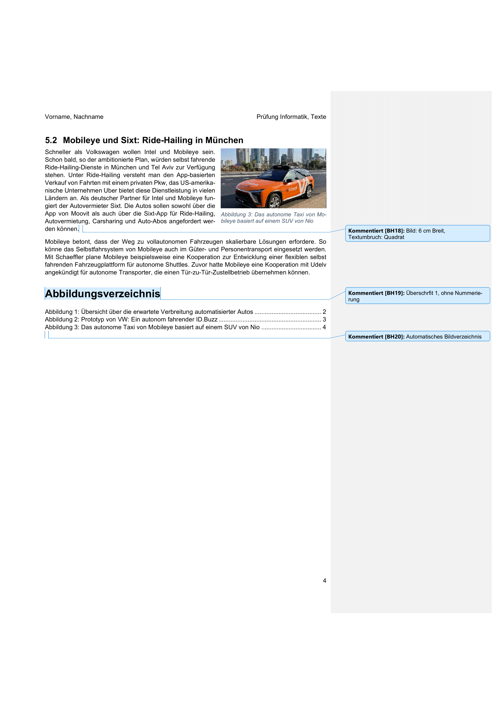

import styles from "./styles.module.scss";
import ProbeV26 from '@site/src/components/ms-docs/v26-nachholer';
import Icon from '@mdi/react';
import { mdiUpload } from '@mdi/js';

# Textdokumente

<Solution webKey="5ba6b51b-db2a-461c-a3d1-ac934806624f" open title="Probe">
 

<ProbeV26 personalize={false} />

 
 

<a className="button button--success" href="https://erzbe-my.sharepoint.com/:f:/g/personal/balthasar_hofer_gbsl_ch/Etn84zkW0TtHtUwLBUMXrQEBCRyt2rGWgfNRr8Ard9HIHQ">
    Hochladen <Icon path={mdiUpload} size={0.7} style={{transform: 'translateY(20%)', marginLeft: '1em', marginRight: '-1em'}} />
</a>

---

</Solution>

