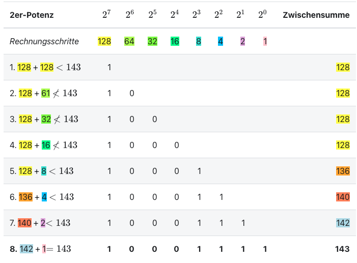

# Codierung


# Code

- Information
- Daten
- Code

Note:
- Information: Das Wissen, das ein **Sender** einem **Empfänger** über eine **Information** übermittelt.
- Daten: **Zeichen oder Symbole** zur Darstellung von Informationen.
- Code: Eine "Sprache", die festlegt, wie Informationen in Daten übersetzt werden.


# Code

<div class="full" style="background: white">


</div>

Note:
Die Informationsübertragung kann nur funktionieren, wenn Sender und Empfänger den gleichen Code verwenden. Bei zwischenmenschlicher Kommunikation ist der Code normalerweise nicht explizit festgelegt. Dann muss der Empfänger den Code erraten, was zu Missverständnissen führen kann.


> Ein Code ist eine Vorschrift, welche Daten von einer Darstellung in eine andere umwandelt.
> Dabei darf keine Information verloren gehen, eine Rückumwandlung muss möglich sein.

<div class="full" style="background: white">


</div>


# Code
<div class="full">


</div>


# Zahlensysteme

Wie lassen sich Zahlen über ein Stromkabel verschicken?


# Zehnersystem

- 10 eindeutige Zeichen

    0, 1, 2, 3, 4, 5, 6, 7, 8, 9
- Jede Stelle wird mit einer Zehnerpotenz multipliziert


# Binärsystem

| $2^8$ | $2^7$ | $2^6$ | $2^5$ | $2^4$ | $2^3$ | $2^2$ | $2^1$ | $2^0$ |
| ----: | ----: | ----: | ----: | ----: | ----: | ----: | ----: | ----: |
|   256 |   128 |    64 |    32 |    16 |     8 |     4 |     2 |     1 |


## Binär -> Dezimal

| $2^8$ | $2^7$ | $2^6$ | $2^5$ | $2^4$ | $2^3$ | $2^2$ | $2^1$ | $2^0$ |     |
| ----: | ----: | ----: | ----: | ----: | ----: | ----: | ----: | ----: | --: |
|   256 |   128 |    64 |    32 |    16 |     8 |     4 |     2 |     1 |     |
|       |       | **1** | **0** | **1** | **1** | **0** | **0** | **1** |     |


## Binär -> Dezimal

| $2^8$ | $2^7$ | $2^6$ | $2^5$ | $2^4$ | $2^3$ | $2^2$ | $2^1$ | $2^0$ |     |
| ----: | ----: | ----: | ----: | ----: | ----: | ----: | ----: | ----: | --: |
|   256 |   128 |    64 |    32 |    16 |     8 |     4 |     2 |     1 |     |
|       |       | **1** | **0** | **1** | **1** | **0** | **0** | **1** |     |
|       |       |   +64 |    +0 |   +16 |    +8 |    +0 |    +0 |    +1 |     |


## Binär -> Dezimal

| $2^8$ | $2^7$ | $2^6$ | $2^5$ | $2^4$ | $2^3$ | $2^2$ | $2^1$ | $2^0$ |        |
| ----: | ----: | ----: | ----: | ----: | ----: | ----: | ----: | ----: | -----: |
|   256 |   128 |    64 |    32 |    16 |     8 |     4 |     2 |     1 |        |
|       |       | **1** | **0** | **1** | **1** | **0** | **0** | **1** |        |
|       |       |   +64 |    +0 |   +16 |    +8 |    +0 |    +0 |    +1 | **89** |


# Binärsystem

<div class="full">


</div>


# Binärsystem

Übung: Zahlensysteme

https://ofi.gbsl.website


# Zeichencodierung

- Anwendungsschicht: Text, Zahlen, Emoijs 🤪, Bilder,...
- Physikalische Schicht: Binär

Übersetzung??? 🤔


# Zeichencodierung

Jedem Zeichen wird eine Zahl zugeordnet.

Das nennt sich **Zeichencodierung**


# Zeichencodierung: ASCII

- `7 bit` Information pro Zeichen
- 33 Steuerzeichen (bspw. neue Zeile)
- 95 normale Zeichen (Buchstaben)


# ASCII

| Zeichen | Zahl | Binär      |
| :------ | :--- | :--------- |
| A       | 65   | `01000001` |
| B       | 66   | `01000010` |
| C       | 67   | `01000011` |
| D       | 68   | `01000100` |
| E       | 69   | `01000101` |
| F       | 70   | `01000110` |
| G       | 71   | `01000111` |


# Python

```py
zahl = ord('A') # => 65
```


# Python

```py
zahl = ord('A') # => 65
bin_zahl = bin(zahl) # => 0b1101100
```


# Python

Ergänzen auf genau 8 bit

```py
zahl = ord('A') # => 65
bin_zahl = bin(zahl) # => 0b1101100

# die ersten beiden Zeichen abschneiden
bin_zahl = bin_zahl[2:]      # => 1101100
# auf 8 Zeichen ergänzen
bin_zahl = bin_zahl.zfill(8) # => 01101100
```


# Python

Ausgabe?

```py
name = 'Maria'
for buchstabe in name:
    print(buchstabe)
```


# Python

Binär zu Zahl

```py
code = '01000111'

# in Zahl umwandeln
zahl = int(code) # => 1000111
```


# Python

Binär zu Zahl

```py
code = '01000111'

# in Zahl umwandeln
zahl = int(code, 2) # => 71
```


# Python

Zahl zu Zeichen

```py
zahl = 71
chr(zahl) # => G
```


# UTF-8

| Unicode-Bereich | Bitmuster                             | Anzahl Bit |
| :-------------- | :------------------------------------ | ---------: |
| 0 bis 127       | `0xxxxxxx`                            |          7 |
| 128 bis 2047    | `110xxxxx 10xxxxxx`                   |         11 |
| 2048 bis 65535  | `1110xxxx 10xxxxxx 10xxxxxx`          |         16 |
| ab 65536        | `11110xxx 10xxxxxx 10xxxxxx 10xxxxxx` |         21 |


# UTF-8

| Zeichen                       | Nummer |                             Bitmuster |
| :---------------------------- | -----: | ------------------------------------: |
| A                             |     65 |                            `01000001` |
| ä                             |    228 |                   `11000011 10100100` |
| Schwarze Sonne mit Strahlen ☀ |   9728 |          `11100010 10011000 10000000` |
| Affe 🐒                       | 128018 | `11110000 10011111 10010000 10010010` |


# UTF-8

| Beginn | Bedeutung                                     |
| :----- | :-------------------------------------------- |
| 0…     | ASCII-Zeichen                                 |
| 10…    | Fortsetzung eines Zeichens mit mehreren Bytes |
| 110…   | Beginn eines Zeichens mit zwei Bytes          |
| 1110…  | Beginn eines Zeichens mit drei Bytes          |
| 11110… | Beginn eines Zeichens mit vier Bytes          |


# UTF-8

<div class="full" style="background: white">


</div>


# Mehrstufige Codierung

<div class="full" style="background: white">


</div>

Note:
Oft werden Informationen mehrstufig codiert. So wird beispielsweise die Information «Ich bin müde.» als Emoji dargestellt. Das Handy ordnet dem Emoji die entsprechende Unicode-Nummer zu. Diese wird mit UTF-8 in eine Bitfolge übersetzt, welche über das Mobilfunknetz übermittelt wird.