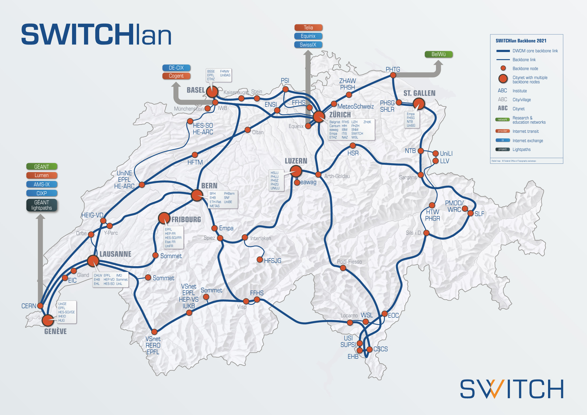
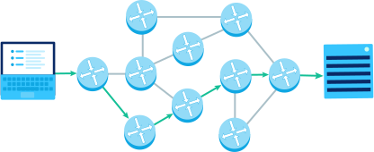

# Routing


## Netzwerk

Schweiz

<div class="full">



</div>

Note:
SWITCH-lan ist das Universitäts-Netz


## Netzwerk

Schweiz

<div class="full">


</div>

Note:
In der Schweiz werden auch Gasleitungen verwendet, um Glasfaserkabel zu verlegen...


## Netzwerk

International

<div class="full">


</div>


## "Bahnhöfe" des Internets

**Router**

<div class="full">



</div>

Note:
verbinden mehrere Netzwerke miteinander


## Router

<div class="full">


</div>

Note:
Router müssen die Pakete auspacken, lesen und anpassen, damit Pakete ans richtige Ort kommen...


## IP-Adresse

```
IP-Adresse finden Windows 10
```


## IP-Adresse

https://whatsmyip.org

unterschiede?


## Ping

Wie ein Echo - wenn unter der gegebenen IP-Adresse ein Dienst vorhanden ist, schickt dieser eine kurze Nachricht zurück...

```sh
ping 194.124.132.216
```


## Traceroute

Über welche Stationen wird ein Paket weitergeschickt?

```sh
# win
tracert 194.124.132.216

# osx
traceroute 194.124.132.216
```


## Traceroute

Über welche Stationen wird ein Paket weitergeschickt?

```sh
# win
tracert srf.ch

# osx
traceroute srf.ch
```


# 💻 - Adressen

- 📡 MAC-Adresse: `48:2C:6A:1E:59:3D`
- 🕸 IP-Adresse: `192.168.1.1`

Note:
MAC: Media Access Control


## 💻 - Adressen

|     | ✅ Vorteil                         | ❌ Nachteil                                     |
| :-- | :-------------------------------- | :---------------------------------------------- |
| MAC | Eindeutig auf der ganzen Welt     | Keine Information, wo sich das Gerät befindet   |
| IP  | Die Adresse verrät, wie das Gerät gefunden wird | Nur im lokalen Netzwerk eindeutig |

Note:
MAC: Wie im Schulzimmer: Namen rufen = klar wer gemeint ist
IP: Cadetg rufen bringt nichts - Raum-Bezeichnung nachschauen, bevor man ruft...

<div>
<div class="level">
<div class="details data">
    <div>4. Anwendungs&shy;schicht</div>
</div>
<div class="details">
    <div>Web, E-Mail</div>
</div>
<div class="spacer"></div>
<div class="highlight package data">Daten</div>
</div>
</div>

<div>
<div class="level">
<div class="details data">
    <div>4. Anwendungs&shy;schicht</div>
</div>
<div class="details">
    <div>Web, E-Mail</div>
</div>
<div class="spacer"></div>
<div class="highlight package data">Daten</div>
</div>

<div class="level">
<div class="details tcp">
    <div>3. Transportschicht</div>
</div>
<div class="details">
    <div>Über&shy;tragungs&shy;steuerungs&shy;protokoll &shy;(TCP)</div>
</div>
<div class="spacer"></div>
<div class="highlight package tcp">
    TCP+Port
    <div class="package data">Daten</div>
</div>
</div>

</div>

<div>
<div class="level">
<div class="details tcp">
    <div>3. Transportschicht</div>
</div>
<div class="details">
    <div>Über&shy;tragungs&shy;steuerungs&shy;protokoll &shy;(TCP)</div>
</div>
<div class="spacer"></div>
<div class="highlight package tcp">
    TCP+Port
    <div class="package data">Daten</div>
</div>
</div>

<div class="level">
<div class="details ip">
    <div>2. Vermittlungs&shy;schicht</div>
</div>
<div class="details">
    <div>Internet&shy;protokoll &shy;(IP)</div>
</div>
<div class="spacer"></div>
<div class="highlight package ip">
    IP-Adresse
    <div class="package tcp">
    TCP+Port
    <div class="package data">Daten</div>
    </div>
</div>
</div>

<div>
<div class="level">
<div class="details ip">
    <div>2. Vermittlungs&shy;schicht</div>
</div>
<div class="details">
    <div>Internet&shy;protokoll &shy;(IP)</div>
</div>
<div class="spacer"></div>
<div class="highlight package ip">
    IP-Adresse
    <div class="package tcp">
    TCP+Port
    <div class="package data">Daten</div>
    </div>
</div>
</div>
<div class="level">
<div class="details mac">
    <div>1. Physikalische Schicht</div>
</div>
<div class="details">
    <div>WLAN, Ethernet</div>
</div>
<div class="spacer"></div>
<div class="highlight package mac">
    MAC-Adresse
    <div class="package ip">
    IP-Adresse
    <div class="package tcp">
        TCP+Port
        <div class="package data">Daten</div>
    </div>
    </div>
</div>
</div>
</div>
