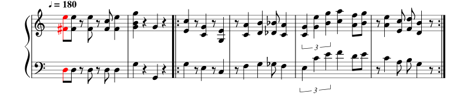
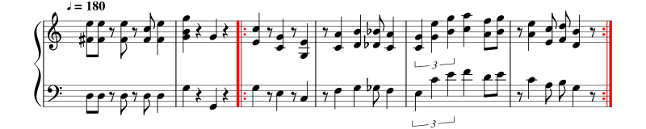

# Praktikum Informatik

- Arbeitsweise einer Maschine <!-- .element: class="fragment" data-fragment-index="1" -->
- Verständigung mit einer Maschine <!-- .element: class="fragment" data-fragment-index="2" -->
  - Einblick in eine Programmiersprache <!-- .element: class="fragment" data-fragment-index="3" -->
  - Python <!-- .element: class="fragment" data-fragment-index="3" -->
- Alle zwei Wochen <!-- .element: class="fragment" data-fragment-index="4" -->

# Heute

- Was ist ein Algorithmus? <!-- .element: class="fragment" data-fragment-index="1" -->
- Darstellungsformen von Algorithmen <!-- .element: class="fragment" data-fragment-index="2" -->
- RoboZZle <!-- .element: class="fragment" data-fragment-index="3" -->

# Schatzsuche

### 5' Verstecken
- in 2er Gruppen einen Schoggi-Schatz verstecken <!-- .element: class="fragment" data-fragment-index="1" -->
- Eine Schatzkarte\* anfertigen <!-- .element: class="fragment" data-fragment-index="1" -->

### 3' Suchen <!-- .element: class="fragment" data-fragment-index="2" -->
- Schatzkarte mit einer anderen Gruppe tauschen <!-- .element: class="fragment" data-fragment-index="2" -->
- 🍫🍫 Suchen <!-- .element: class="fragment" data-fragment-index="2" -->

# \*Schatzkarte

- Die Schatzkarte beginnt bei der Markierung ⬆️
- Für die Beschreibung dürfen **ausschliesslich** folgende Symbole verwendet werden:
  - ↑ (=1 Schritt vorwärts) <!-- .element: class="fragment" data-fragment-index="1" -->
  - ↰ (=90° nach links) <!-- .element: class="fragment" data-fragment-index="2" -->
  - ✅ (=gefunden) <!-- .element: class="fragment" data-fragment-index="3" -->

In dieser Sprache: <!-- .element: class="fragment" data-fragment-index="4" -->
- gibt es "↱" nicht ⚠️  <!-- .element: class="fragment" data-fragment-index="5" -->
- kann z.B. "3x ↑" nicht interpretiert werden ⚠️ <!-- .element: class="fragment" data-fragment-index="6" -->

# Algorithmus

> «Ein Algorithmus beschreibt die Methode, mit der eine Aufgabe gelöst wird. Ein Algorithmus besteht aus einer Folge von Schritten, deren korrekte Abarbeitung die gestellte Aufgabe löst. Die Abarbeitung oder den Vorgang selbst bezeichnet man als Prozeß.»
>
> *Les Goldschlager/Andrew Lister: Informatik, 1984*

Note:
| Prozess            | Algorithmus   | Typischer Schritt                 |
| :----------------- | :------------ | :-------------------------------- |
| Kranich falten     | Faltanleitung | Papier entlang einer Linie falten |
| Zimtsterne backen  | Rezept        | Eier schaumig schlagen            |
| Musikstück spielen | Notenblatt    | Ein c' spielen                    |

## Spezielle Sprachen

- Fachsprache oder symbolische Sprache <!-- .element: class="fragment" data-fragment-index="1" -->
- kürzere und klarere Beschreibung der einzelnen Schritte <!-- .element: class="fragment" data-fragment-index="2" -->
- Einheitliche Verwendung = universell einsetzbar <!-- .element: class="fragment" data-fragment-index="3" -->

# Struktur

- Definiert die Reihenfolge der Einzelschritte  <!-- .element: class="fragment" data-fragment-index="1" -->
- Die Struktur eines Algorithmus ist universell <!-- .element: class="fragment" data-fragment-index="2" -->

# Strukturen

- Sequenz 👣  <!-- .element: class="fragment" data-fragment-index="1" -->
- Wiederholung 🔁  <!-- .element: class="fragment" data-fragment-index="2" -->
- Bedingte Ausführung ⑂  <!-- .element: class="fragment" data-fragment-index="3" -->
- Unterprogramm: 🏷 Beschriftung einer Sequenz  <!-- .element: class="fragment" data-fragment-index="4" -->
- Parameter ⊕ ⊖  <!-- .element: class="fragment" data-fragment-index="5" -->

Note:
**Sequenz**: Es wird ein Schritt nach dem anderen abgearbeitet.
**Wiederholung**: Einer oder mehrere Schritte werden eine bestimmte Anzahl mal wiederholt.
**Bedingte Ausführung**: bspw. Backen: Grundmasse gleich, für Schokokuchen oder Fruchtkuchen unterschiedlich...
**Unterprogramm**: Mehrere Schritte können zusammengefasst und mit einem Namen versehen werden. Anstatt immer wieder alle Schritte aufzuführen, wird nur der Name angegeben.
**Parameter**: Das Ergebnis eines Algorithmus kann variiert werden durch Werte, welche bei jeder Ausführung neu festgelegt werden.

# Endlichkeit

⚠️ Ein Algorithmus muss nach endlich vielen Einzelschritten enden

# Falten

<!-- .element: class="r-stretch" -->

Note:
3 Arten von Schritten
- **Falten**: Durch eine gestrichelte Linie wird angedeutet, wo gefaltet werden soll. Der Pfeil gibt an, in welche Richtung gefaltet wird.
- **Falz machen**: Durch Hin- und Zurückfalten wird ein Falz erzeugt. Dies wird durch einen Pfeil angedeutet, der hin und zurück zeigt.
- **Drehen**: Durch einen Pfeil zwischen zwei Abbildungen wird angezeigt, dass das Papier entsprechend umgedreht werden soll.

# Bauanleitung

<!-- .element: class="r-stretch" -->

Note:
- Schritt
- Wiederholung
- Bedingte Ausführung (ein Stück fehlt)

# Noten

<!-- .element: class="r-stretch" -->

Note:
Schritt

# Noten

<!-- .element: class="r-stretch" -->

Note:
Wiederholung

# Noten

<!-- .element: class="r-stretch" -->

<audio controls>
    <source src="/sounds/music-conditional-1.mp3" type="audio/mpeg"/>
</audio>
<audio controls>
    <source src="/sounds/music-conditional-2.mp3" type="audio/mpeg"/>
</audio>

Note:
Bedingte Ausführung

# Noten

<!-- .element: class="r-stretch" -->

Note:
Parameter

# Flussdiagramm
<!-- .element: class="r-stretch" -->

Note:
**Programmablaufplan** ist eine grafische Darstellungsform eines Algorithmus. Es besteht aus Elementen, welche einzelne Schritte des Algorithmus darstellen.
- Pfeile geben die Reihenfolge an
- Napoletana ruft Spaghetti-Programm auf
- Parameter: n Portionen

# RoboZZle

<!-- .element: class="r-stretch" -->

- Ziel: Algorithmus finden, welcher alle Sterne auf dem Spielfeld erwischt<!-- .element: class="fragment" data-fragment-index="1" -->
- Symbole: ↑, ↰, ↱<!-- .element: class="fragment" data-fragment-index="2" -->
- Unterprogramme: F1, F2<!-- .element: class="fragment" data-fragment-index="3" -->
- Bedingte Ausführung Farben<!-- .element: class="fragment" data-fragment-index="4" -->