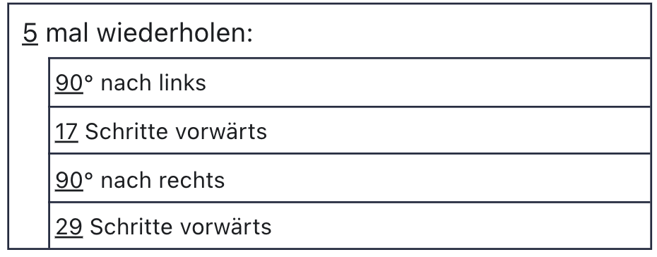
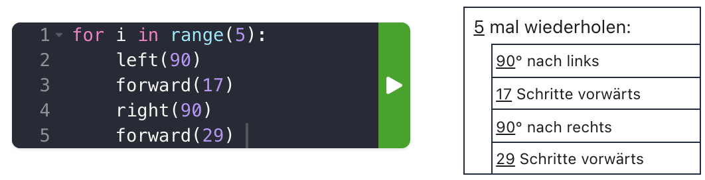

# Python


## Zu zweit...

- zeichnen Sie auf ein Papier einen zusammenhängenden Pfad (max. 10 Segmente)
- tauschen Sie die Zeichnungen
- Versuchen Sie, die Zeichnung mit einer Turtle zu reproduzieren


## Algorithmus

- Sequenz 👣
- **Wiederholung** 🔁
- Bedingte Ausführung ⑂
- Unterprogramm: 🏷 Beschriftung einer Sequenz
- Parameter ⊕ ⊖


## Struktogramme

Struktogramme sind eine Möglichkeit, Programme und Algorithmen grafisch darzustellen. Diese Dartstellungsform wurde 1973 von Isaac Nassi und Ben Shneiderman vorgeschlagen und heisst deshalb auch Nassi-Shneiderman-Diagramm.


## Sequenz

- Ein Schritt = ein rechteckiger Kasten
- Befehle in Alltagssprache
- Parameter werden unterstrichen


## Beispiel


## Treppe

Wie viele Zeilen Code haben Sie gebraucht?


## Code

Wiederholter Teil:
```py
left(90)
forward(17)
right(90)
forward(29)
```


## Struktogramm




## Python


