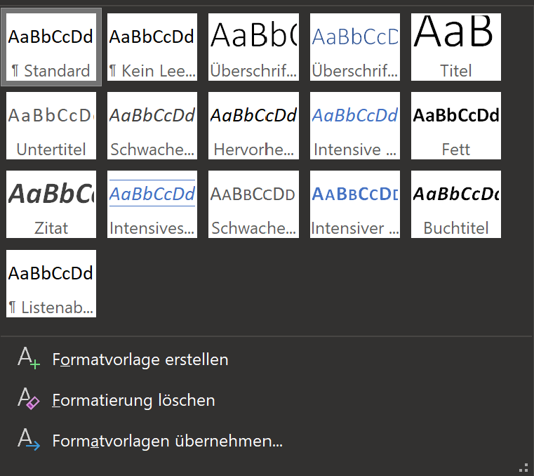

---
sidebar_custom_props:
  id: ddcd6ef9-5eb0-4bb9-96e1-87baa48840c0
---

import useBaseUrl from '@docusaurus/useBaseUrl';

# Textaufbau in Word

:::caution Vorgehen

1. Theorie durchlesen - überlegen Sie sich nach jedem Abschnitt, ob Ihnen die Inhalte bekannt vorkommen und ob Sie sich zutrauen, diese Schritte selber durchzuführen.
2. Markieren Sie in [diesem Dokument](https://erzbe-my.sharepoint.com/:w:/g/personal/balthasar_hofer_gbsl_ch/EZzjhrkIPrhGrQVoLbz3WgMBKi6PihXFLJJT23-xVAFj9A?e=hu7Caq), ob Sie diese Inhalte gerne vorgeführt erhalten würden. 
3. Bearbeiten Sie die untenstehende Aufgabe
4. Wenn Sie fertig sind, zeigen Sie das Resultat Herrn Hofer

:::

## Drei Strukturebenenen
Ein Word-Dokument kennt drei verschiedene Strukturebenenen:

- Abschnitt
  - Absatz
    - Zeichen

Auf jeder Strukturebene lassen sich unterschiedliche Formatierungen vornehmen.

### Abschnitt
In einem Abschnitt wird das grundlegende Erscheinungsbild vorgegeben.
- Ausrichtung
- Format
- Spalten (Text auf mehrere Spalten verteilen)
- Seitenränder
- Seitenzahlen

Unter **Layout** lassen sich viele *Abschnitt-Einstellungen* vornehmen und auch *Abschnitt-Umbrüche* einfügen. Durch Klicken auf den rot eingefärbten Pfeil können zudem weitere Einstellungsmöglichkeiten angezeigt werden.

Jeder Abschnitt kann unabhängig vom Vorhergehenden/Nachfolgenden konfiguriert werden. Im Beispiel oben werden also zwei Fortlaufende Umbrüche (`Umbrüche>(Abschnittumbrüche)>Fortlaufend`) eingefügt, damit kein Seitenwechsel passiert.

:::flex
 
***

:::

#### Silbentrennung

Die Silbentrennung ermöglicht es, Wörter automatisch an geeigneter Stelle zu trennen, wenn dadurch der Verfügbare Platz auf einer Zeile besser genutzt werden kann. Das Layout wirkt dadurch aufgeräumter und das Lesen ist angenehmer. Diese Option muss jedoch von Hand unter `Layout > Silbentrennung` auf *Automatisch* gesetzt werden.

### Absatz
Ein Absatz entsteht, wenn eine neue Zeile mit der Enter-Taste eingefügt wird. EIn Absatz wird grundsätzlich gemäss der zugewiesenen **Formatvorlage** formatiert. Diese Einstellungen können aber auch in jedem Absatz angepasst werden.

#### Formatvorlagen

Mit einer Formatvorlage können Struktur- und Darstellungsinformationen zusammengefasst werden. **Strukturinformationen** beziehen sich auf die Art des Absatzes - ist es eine *Überschrift*, eine *Unterüberschrift*, ein *normaler Text* oder ...? Durch das Hinterlegen dieser Strukturinformationen kann Word bspw. automatisch die Überschriften nummerieren oder automatisch ein Inhaltsverzeichnis generieren. Da auch Darstellungsinformationen hinterlegt werden können, wird ein Dokument *einheitlich* und ohne viel Aufwand formatierbar. Für die Änderung der Schriftgrösse von allen Überschriften muss dann nur die Formatvorlage angepasst werden und nicht jede einzelne Überschrift.

Es gibt vordefinierte Formatvorlagen, die einem Absatz zugewiesen werden können:

Die Formatvorlagen können auch nach den eigenen Wünschen **angepasst** werden:

:::flex

***

:::

:::tip
Erstellen Sie keine neuen Formatvorlagen für Überschriften sonder passen Sie die vorhandenen Vorlagen an. So funktioniert die Nummerierung und das automatische Inhaltsverzeichnis ohne weitere Konfiguration.
:::

#### Formatierungen

Tabstopps
: [[┗]] [[┻]] [[┛]]
: der Cursor :mdi-cursor-text: springt beim Drücken der Tabulator-Taste [[:mdi-keyboard-tab:]] bis zu diesem Tabstopp.
: Die Ausrichtung bestimmt, wie der Tabulator-Text ausgerichtet wird:
: [[┗]] :mdi-arrow-right-thin: :mdi-format-align-left:  
: [[┻]] :mdi-arrow-right-thin: :mdi-format-align-center:  
: [[┛]] :mdi-arrow-right-thin: :mdi-format-align-right:
: Die Ausrichtung kann durch Doppelklicken auf den Tabstopp geändert werden.
Linker Einzug
: [[⧋]]
: Der gesamte Absatz wird eingerückt.
Erstzeileneinzug
: [[▽]]
: Die erste Zeile eines Absatzes kann eigens kontrolliert werden.

:::tip
Unter **Ansicht > Anzeige** kann das Lineal eingeblendet werden.
:::

- Textausrichtung (Links, Zentriert, Rechts, Blocksatz)
- Auflistungen
- Rahmen
- Zeilenabstand (der Zeilenabstand innerhalb eines Absatzes)
- Absatzabstand (der Abstand zum vorherigen/nächsten Absatz)

:::flex --align-items=flex-end

***

:::

:::tip
Ein Zeilenumbruch im selben Absatz kann mit `Shift+Enter` erzeugt werden.
:::

### Zeichenformat

Einzelne Wörter und Buchstaben/Zeichen lassen sich individuell formatieren. So kann etwa festgelegt werden, ob ein Zeichen kursiv, fett oder unterstrichen dargestellt werden kann.

#### Einfügen

Beim Einfügen von kopiertem Text, bspw. von einer Website, werden auch die Zeichenformate mitkopiert (z.B. Links werden dann farbig angezeigt...). Dies ist nicht immer erwünscht und teilweise soll nur der Text übernommen werden. Dann kann über die Einfüge-Optionen *Nur den Text übernehmen* ausgewählt werden:

## Übung

:::aufgabe

Laden Sie das Word-Dokument [ex01-what-is-programming.docx](files/ex01-what-is-programming.docx) herunter.

1. Verschieben Sie die Datei auf OneDrive in Ihren Informatik-Ordner.
2. Formatieren Sie Ihr Word-Dokument so, dass es am Ende wie in der Vorlage unten aussieht:

:::
